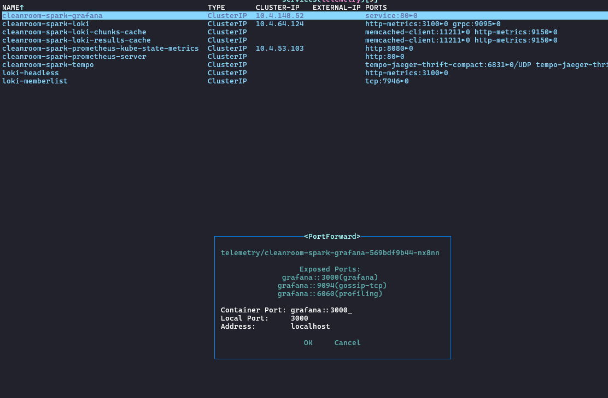
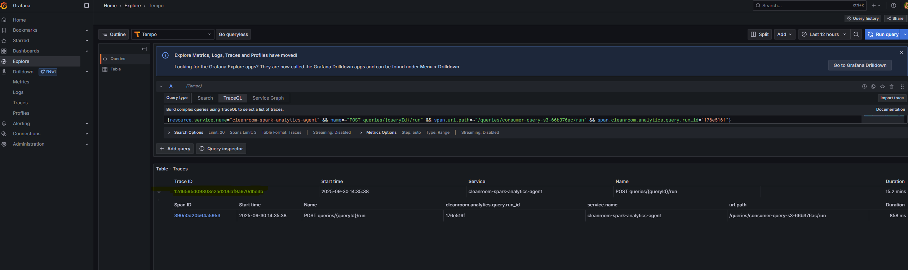
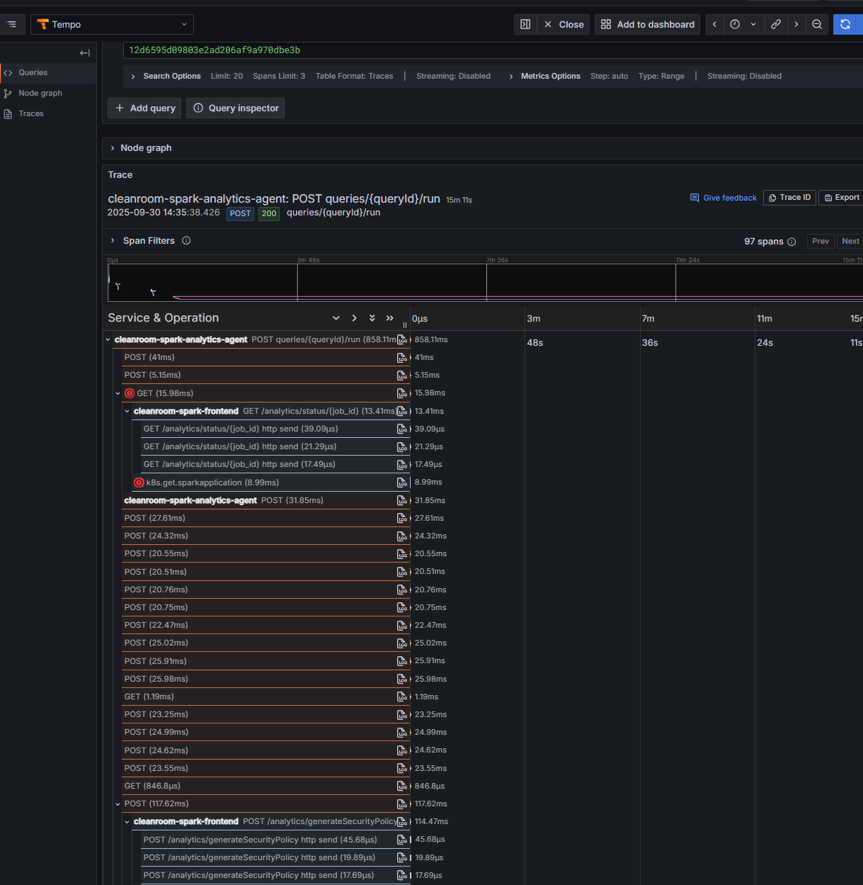
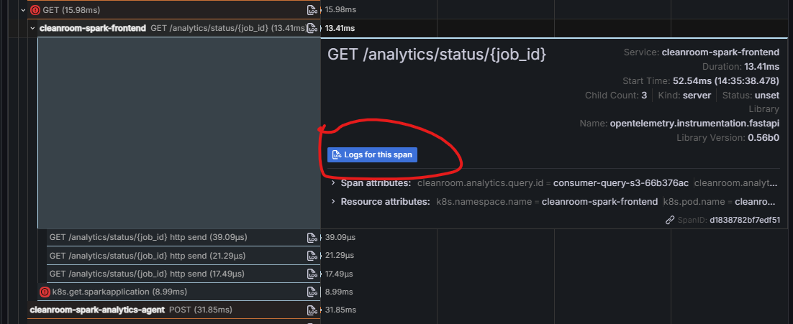
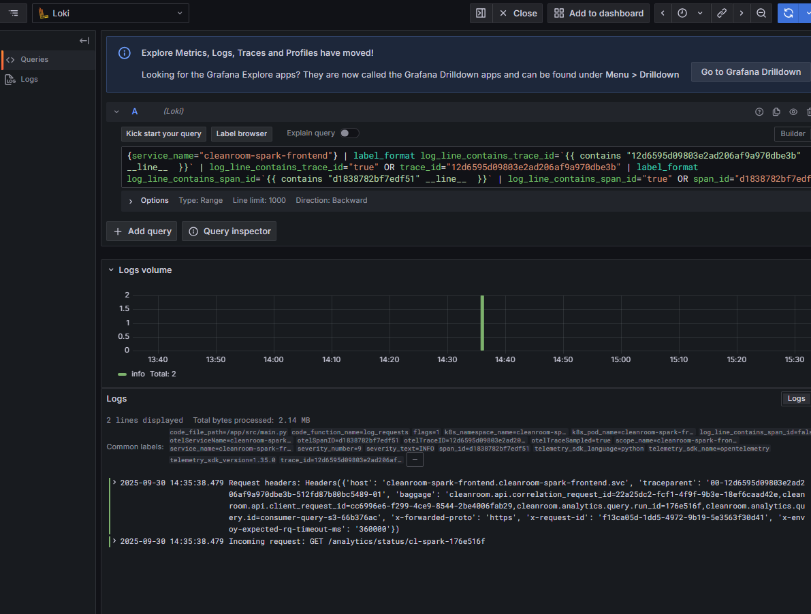
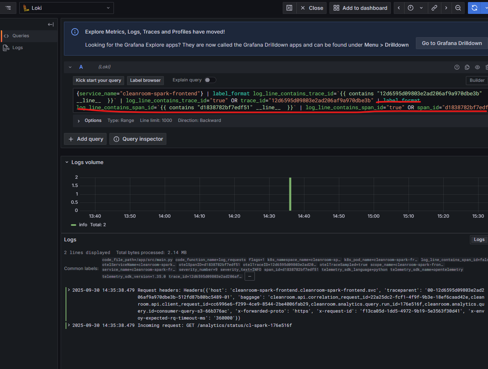

# TSGs
## TSGs for Big Data Analytics Scenario.
This guide walks through the ways to obtain traces / logs from the cleanroom cluster and lists the the TSGs for the Analytics Scenario.

### Pre-reqs
- Deployed Cleanroom cluster with kubeconfig
- The Cleanroom cluster should be deployed with observability enabled.
  - `--enable-observability` flag is passed in `cluster create`
- `k9s` connected to the cleanroom cluster.
- `kubectl` for running commands on the cluster.

### Steps to get access to the traces / logs 
Every cleanroom cluster deployed with an observability system uses Grafana as the visualization tool. To get access to the Grafana instance for debugging, run the following steps:
- To get the kubeconfig of the cluster, run `az cleanroom cluster get-kubeconfig`
- To open the cluster in k9s, run `k9s --kubeconfig <PATH_TO_KUBECONFIG>`
- Navigate to the "telemetry" namespace and open services. You can use ":svc" to list the services.
- Find "cleanroom-spark-grafana" and enable port forwarding on that [Use Shift + f].
  
- To find the password, run the following command
  - `kubectl get secret -n telemetry cleanroom-spark-grafana -o jsonpath='{.data.admin-password}' --kubeconfig <PATH_TO_KUBECONFIG> | base64 -d`
- Once done, go to localhost:3000 on the browser.
- In the login portal, enter username as "admin" and password from above to login. Once open, you can go to `Explore` and use the below steps to explore traces and logs.

### Navigating Traces for a Spark SQL Query run.

#### Pre-reqs
- The Query Id that is executed
- The Run Id of the execution (returned by `/queries/<queryId>/run`)

### Steps
- Login to grafana and navigate to the 'Explore' tab,
- In the query editor window, Run the TraceQL query `{resource.service.name="cleanroom-spark-analytics-agent" && name="POST queries/{queryId}/run" && span.cleanroom.analytics.query.id="consumer-query-s3-66b376ac" && span.cleanroom.analytics.query.run_id="176e516f"}` to find the trace Id. Click on the Trace ID to see the details of the trace and all the components / spans involved.

- The detailed view looks like

- For each span, you can click at the "Logs for this span" button to get the logs from the involved component

- The logs window looks like

- For viewing all the logs from that component for that particular trace Id, you can remove the span specific query from the query window.


## Useful queries:

> [!NOTE]
> These queries are not an exhaustive list. Add more queries to the list to improve this TSG.
>

### For traces:
List all the query runs in the cluster:

`{resource.service.name="cleanroom-spark-analytics-agent" && name="POST queries/{queryId}/run"}`

List all spans with a correlation id:

`{resource.service.name="cleanroom-spark-analytics-agent" && span.cleanroom.api.correlation_request_id="afd42e75-fb3f-417b-a65d-f284a7c071ef"}`

Find the trace with a run Id and document Id:

`{resource.service.name="cleanroom-spark-analytics-agent" && name="POST queries/{queryId}/run" && span.cleanroom.analytics.query.id="consumer-query-s3-66b376ac" && span.cleanroom.analytics.query.run_id="176e516f"}`

### For logs:
Show all logs of a component

```powershell
{service_name="cleanroom-spark-analytics-agent"} |= ``
``` 

Find all logs for a particular trace Id emitted by a component:

```powershell
{service_name="cleanroom-spark-frontend"} | label_format log_line_contains_trace_id=`{{ contains "526d01ccbe9fb1fc526a670ad5966448" __line__  }}` | log_line_contains_trace_id="true" OR trace_id="526d01ccbe9fb1fc526a670ad5966448"
```
