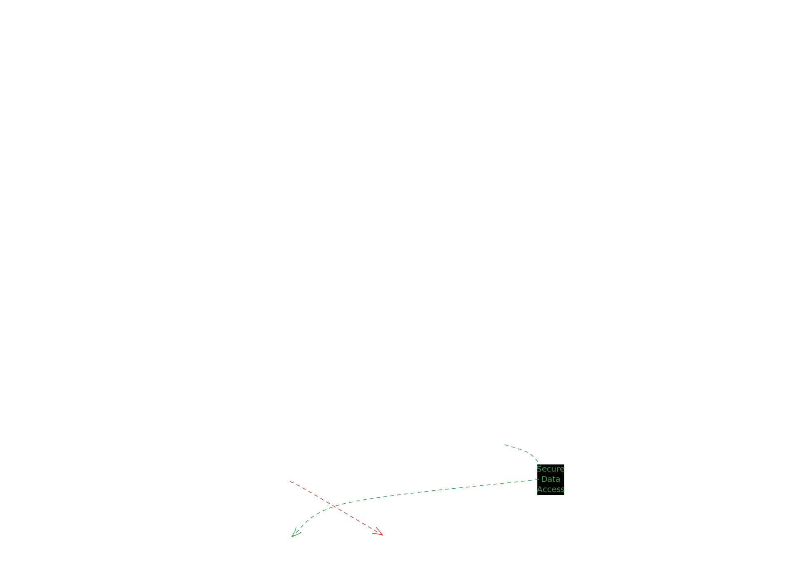
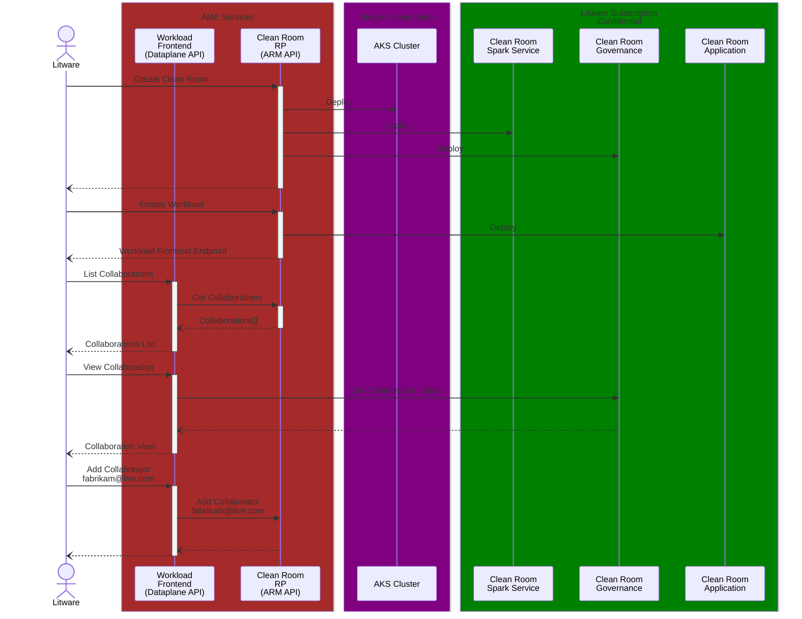
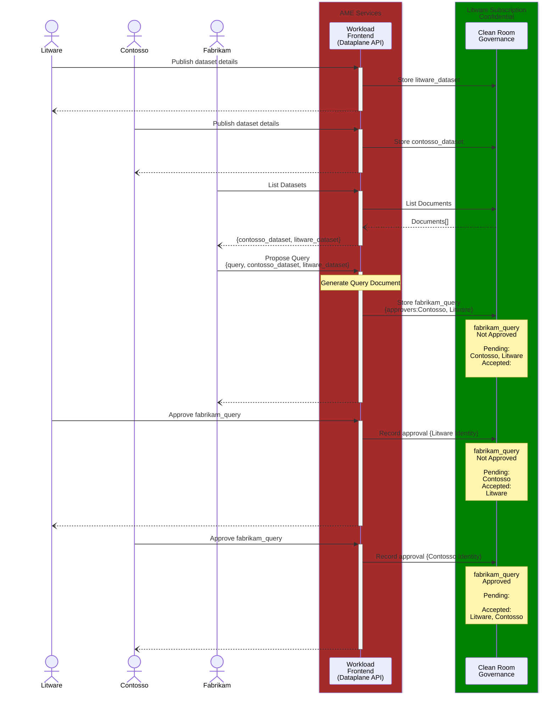
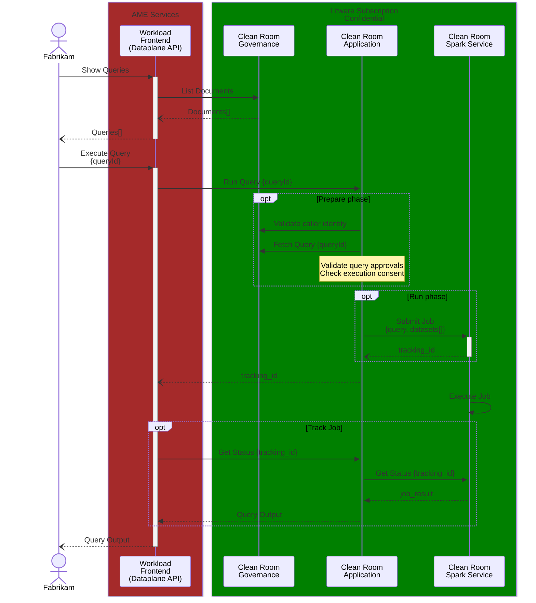
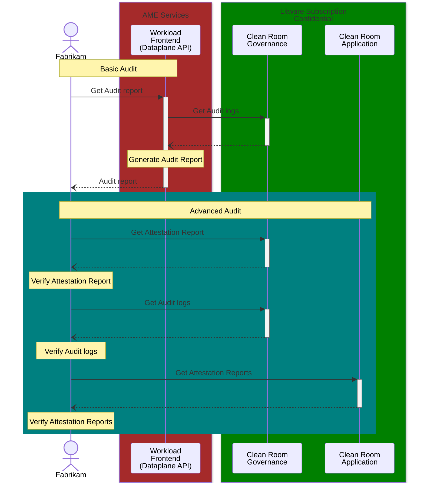
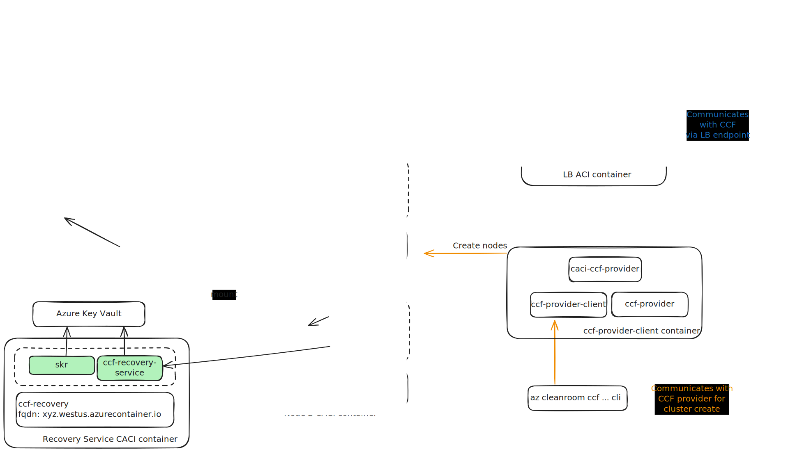
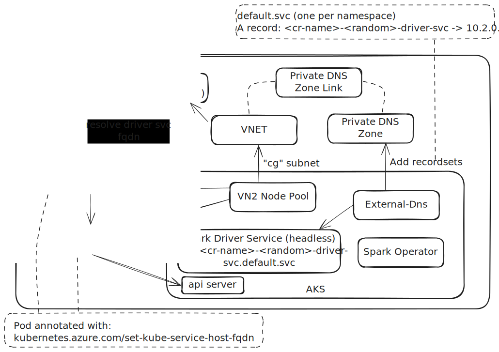

# Managed Clean Rooms for 1P Workloads <!-- omit from toc -->

- [Goal](#goal)
- [Adoption Challenges](#adoption-challenges)
- [Proposal - Build \& Operate](#proposal---build--operate)
  - [Managed Facilities](#managed-facilities)
  - [Developer Facilities](#developer-facilities)
- [Proposal - Build \& Transfer](#proposal---build--transfer)
- [Component View - Level 0](#component-view---level-0)
- [Component View - Level 1](#component-view---level-1)
- [Comparison with previous approach for Analytics using ACCR](#comparison-with-previous-approach-for-analytics-using-accr)
- [Flow - Initial Setup](#flow---initial-setup)
  - [Initial Setup - Detailed Diagrams](#initial-setup---detailed-diagrams)
- [Flow - Configure Workload](#flow---configure-workload)
  - [Configure Workload - Detailed Diagrams](#configure-workload---detailed-diagrams)
- [Flow - Execute Workload](#flow---execute-workload)
  - [Execute Workload - Detailed Diagrams](#execute-workload---detailed-diagrams)
- [Flow - Audit](#flow---audit)
- [FAQ](#faq)
- [Component View - Level 2](#component-view---level-2)
  - [Clean Room CCF Network](#clean-room-ccf-network)
  - [Clean Room Spark Service](#clean-room-spark-service)
- [Pending](#pending)

## Goal

- Ease adoption of Azure Clean Room and associated ACC components for privacy sensitive 1P workloads
- Maintain Zero-Trust guarantees

## Adoption Challenges

- Functional: Lack of big data engine support within a clean room
- Developer: Entry barrier for 1P engineering teams
   - Confidential computation concepts
   - Managing consortiums for governing clean rooms
   - Consuming datasets residing off Azure or cross tenant within Azure
- Business: Low prioritization - legal requirements driven and is a function of CELA demands around privacy protection.

## Proposal - Build & Operate

Build & operate a framework for hosting pre-defined 1P workload applications with privacy protection guarantees.

### Managed Facilities

- Managed Confidential Consortium: for governance & audit of collaboration membership, query documents and access to sensitive data
- Managed Confidential Clean Room Application: for executing workload specific clean room application enforcing governance and data access policies
- Managed Confidential Clean Room Spark Service: for executing workload specific spark application accessing sensitive data

### Developer Facilities

Seamless scaffolding for hosting the following:

- Workload specific frontend service - collaborator management, clean room application invocation, governed document store access
- Workload specific clean room application - governed document store access, confidential spark job submission
- Workload specific spark application - governed document store access, confidential access to sensitive data, confidential identity

## Proposal - Build & Transfer

Build & transfer v1 of 1P workload applications requiring privacy protection guarantees.

- Analytics (Spark-SQL Query Executor)
- ML-Workload?

## Component View - Level 0

## Component View - Level 1

## Comparison with previous approach for Analytics using ACCR
A comparison with the [Analytics sample](https://github.com/Azure-Samples/azure-cleanroom-samples/tree/main/demos/analytics) in the clean room samples repo and Managed Clean Room for Analytics is given below:

| Category | Analytics sample | Managed Clean Room for Analytics |
| --- | --- | --- |
| Spark-SQL query support | Yes | Yes |
| Spark Engine Support      | Runs an in-memory Spark engine | Runs a multi-node Spark cluster in AKS using [Spark Operator](https://www.kubeflow.org/docs/components/spark-operator/overview/) |
| Scaling                   | No big data support, limited to a single CACI container group instance               | Spark driver pod can dynamically decide the number of executor pods (CACI container groups) to create to handle the query |
| Container management      | Directly creates a CACI container group instance to run the query | Submits a pod spec in AKS that is backed by a VN2 node pool. This in turn creates the CACI container group instances (one per pod) to run the query. |
| Consortium Management     | Users can themselves create and manage the CCF instance or use Microsoft.CleanRoom RP for CCF creation and management | Managed Clean Room automatically creates and operates the CCF instance, no user actions required |
| Membership Management     | - Collaborators create and manage certificates for their identity  - Collaborators are added into the consortium by certificates  - Collaborators need to interact directly via CLI/REST APIs with the CCF endpoint for membership management actions | - No certificate management. Collaborators use their Entra ID or MS work/school account for their identity  - Collaborators are invited into the consortium using their identity (ie email address)  - No direct interaction required with CCF, collaborators interact via a UX that is backed by the Analytics frontend service |
| Contract management       | Collaborators interact directly via CLI/REST APIs with the CCF endpoint to create a clean room contract to capture the clean room specification | No exposure to the notion of contracts, collaborators deal with the abstraction of creating cleanrooms, publishing datasets and queries while contract management in CCF for these actions happens automatically |
| Analytics Spark-SQL Application | - Application (container code) performing Spark-SQL queries is developed and maintained by the customer  - Onus of review and measurement of the container on customer | - Application (container code) performing Spark-SQL queries is developed and maintained by Microsoft  - Onus of review and measurement of the container on Microsoft |
| Dataset publishing        | - Publishing dataset requires collaborators to use CLI/SDK to add sections into the cleanroom contract  - Collaborators must propose and approve the contract in CCF | - Datasets are added into a collaboration via an Analytics UX powered by the Analytics frontend service  - No explicit voting/approval action by a collaborator is required  - The underlying document creation in CCF for the dataset happens automatically|
| Secrets Management        | - Customer manages data access secrets in either AKV, using MI or as secrets in CCF hosted in customer's subscription   - Customer has to perform actions via script/CLI to add keys in AKV or secrets in CCF | - Data access secrets continue to remain in AKV, MI or CCF hosted in customer's subscription as before  - Analytics UX helps configure AKV/CCF with secrets without introducing any new trust in the Managed Clean Room services|
| Query publishing          |  - A collaborator need to create a document in CCF via via CLI/SDK which contains the query and other collaborators need to approve it. |  - Queries are authored via an Analytics UX powered by the Analytics frontend service and other collaborators need to approve it. - The underlying document creation in CCF for the query happens automatically. |
| Query approval            | Collaborators approve a query by voting on the document in CCF via CLI/SDK | Collaborators approve a query via the Analytics UX |
| Deployment | A collaborator needs to deploy a CACI ARM template to run the Spark-SQL queries | Managed Clean Room deploys all the required components to run the Spark-SQL queries |
| Query execution | Collaborators directly interacts with REST API endpoints exposed by the CACI instance to run queries | Collaborators interacts with the Analytics UX powered by the Analytics frontend service to run queries |
| Tailored experience       | - No out of the box tailored experience for specific scenarios  - Need to use the building blocks to stitch together a workload/scenario specific experience | - Provides a tailored and workload specific UX using the building blocks developed for ACCR  - Collaborators get an Analytics specific clean room user experience |
| CLI/SDK support           | Yes | Yes |

## Flow - Initial Setup

### Initial Setup - Detailed Diagrams

- [Create Clean Room](./intial-setup.md#create-clean-room)
- [Enable Workload](./intial-setup.md#enable-workload)
- [View Collaboration (Owner)](./intial-setup.md#view-collaboration-owner)
- [Add Collaborator (Frontend)](./intial-setup.md#add-collaborator-workload-frontend---zero-trust)
- [Add Collaborator (RP)](./intial-setup.md#add-collaborator-clean-room-rp---ame-trust)
- [View Collaboration (User)](./intial-setup.md#view-collaboration-user)

## Flow - Configure Workload

### Configure Workload - Detailed Diagrams

- [Publish Dataset - Azure Collaborator](./configure-workload.md#publish-dataset---azure-collaborator)
- [Publish Dataset - Off Azure Collaborator](./configure-workload.md#publish-dataset---off-azure-collaborator)
- [Publish Query](./configure-workload.md#publish-query)

## Flow - Execute Workload

### Execute Workload - Detailed Diagrams

- [Prepare Phase](./execute-workload.md#prepare-phase)
- [Run Phase](./execute-workload.md#run-phase)

## Flow - Audit

## FAQ

See [here](./faq.md).

## Component View - Level 2

### Clean Room CCF Network

See more details [here](../../src/ccf/docs/recovery.md)

### Clean Room Spark Service

## Pending

Architecture:

- Clean Room Frontend Framework
- CCF Recovery Service
- Consortium Manager
  - Recover Consortium: CCF confidential recovery protocol
  - CCF member certificate recovery protocol - JIT & break glass
- Membership Manager
