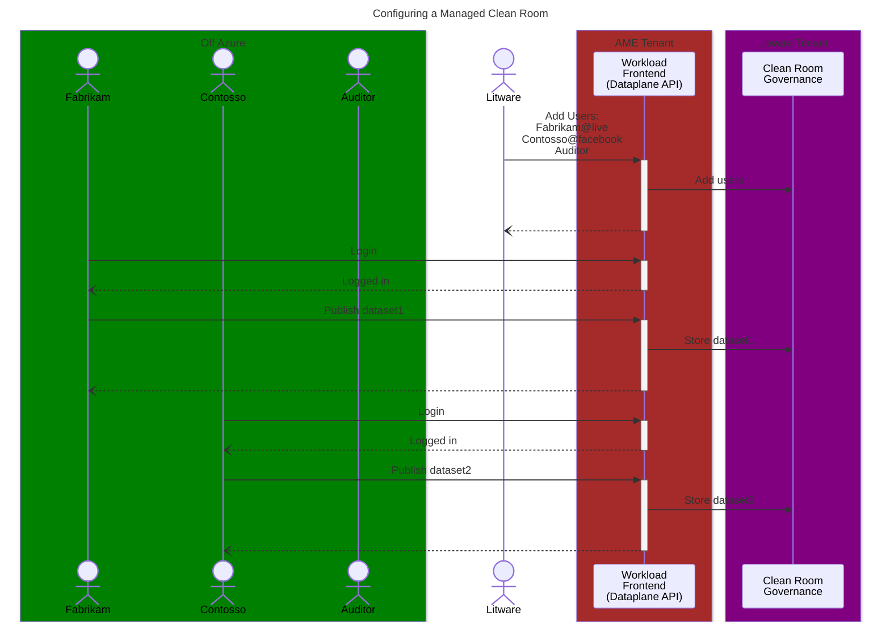
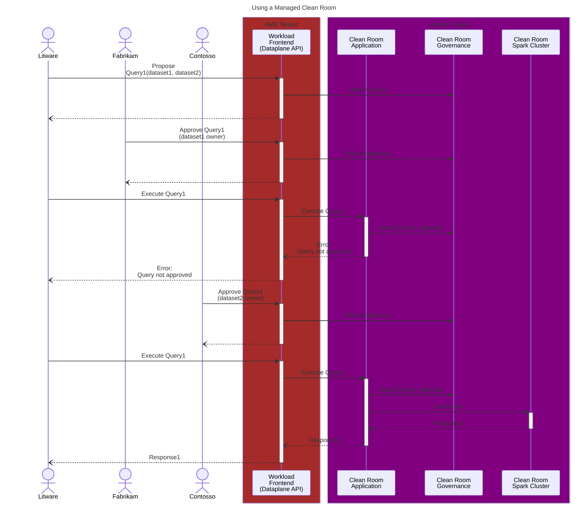

# Managed Clean Room Flow Diagrams

## Collaborator View

### Configuring a Managed Clean Room

```mermaid
sequenceDiagram
title Configuring a Managed Clean Room

box green Off Azure
    actor User1 as Fabrikam
    actor User2 as Contosso
    actor User3 as Auditor
end

actor Owner as Litware

box brown AME Tenant
    participant FE as Workload<br>Frontend<br>(Dataplane API)
end

box purple Litware Tenant
    participant CGS as Clean Room<br>Governance
end

    Owner->>+FE: Add Users:<br>Fabrikam@live<br>Contosso@facebook<br>Auditor
    FE->>CGS: Add users
    FE--)-Owner: <br>

    User1->>+FE: Login
    FE--)-User1: Logged in
    User1->>+FE: Publish dataset1
    FE->>CGS: Store dataset1
    FE--)-User1: <br>

    User2->>+FE: Login
    FE--)-User2: Logged in
    User2->>+FE: Publish dataset2
    FE->>CGS: Store dataset2
    FE--)-User2: <br>

```

### Using a Managed Clean Room

```mermaid
sequenceDiagram
title Using a Managed Clean Room

actor Owner as Litware
actor User1 as Fabrikam
actor User2 as Contosso

box brown AME Tenant
    participant FE as Workload<br>Frontend<br>(Dataplane API)
end

box purple Litware Tenant
    participant TEE as Clean Room<br>Application
    participant CGS as Clean Room<br>Governance
    participant Spark as Clean Room<br>Spark Cluster
end

    Owner->>+FE: Propose<br>Query1(dataset1, dataset2)
    FE->>CGS: Store Query1
    FE--)-Owner: <br>

    User1->>+FE: Approve Query1<br>(dataset1 owner)
    FE->>CGS: Record approval
    FE--)-User1: <br>

    Owner->>+FE: Execute Query1
    FE->>+TEE: Execute Query1
    TEE->>CGS: Check Query1 Approval
    TEE--)-FE: Error:<br>Query not approved
    FE--)-Owner: Error:<br>Query not approved

    User2->>+FE: Approve Query1<br>(dataset2 owner)
    FE->>CGS: Record approval
    FE--)-User2: <br>

    Owner->>+FE: Execute Query1
    FE->>+TEE: Execute Query1
    TEE->>CGS: Check Query1 Approval
    TEE->>+Spark: Submit job
    Spark--)-TEE: Response1
    TEE--)-FE: Response1
    FE--)-Owner: Response1
```
