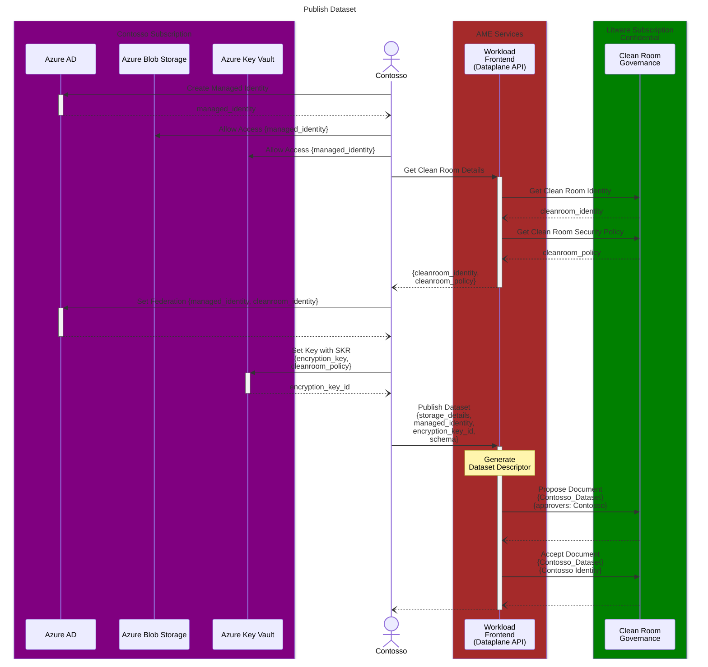
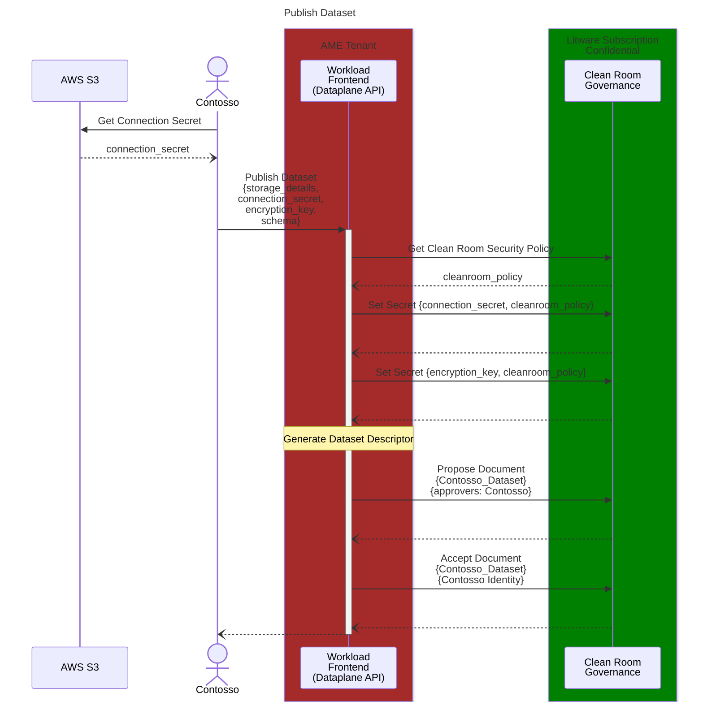
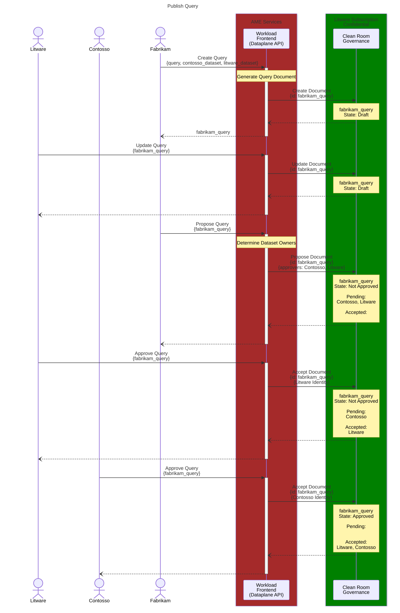

# Configure Workload Sequence Diagrams

Detailed sequence diagrams for interactions between various components as part of configuring a workload (publishing datasets and queries).

## Publish Dataset - Azure Collaborator

## Publish Dataset - Off Azure Collaborator

## Publish Query

