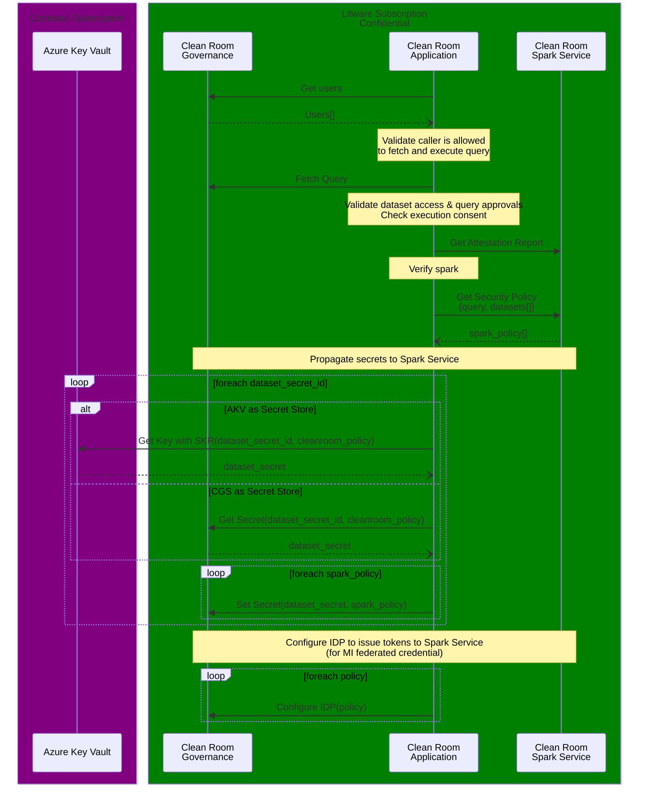
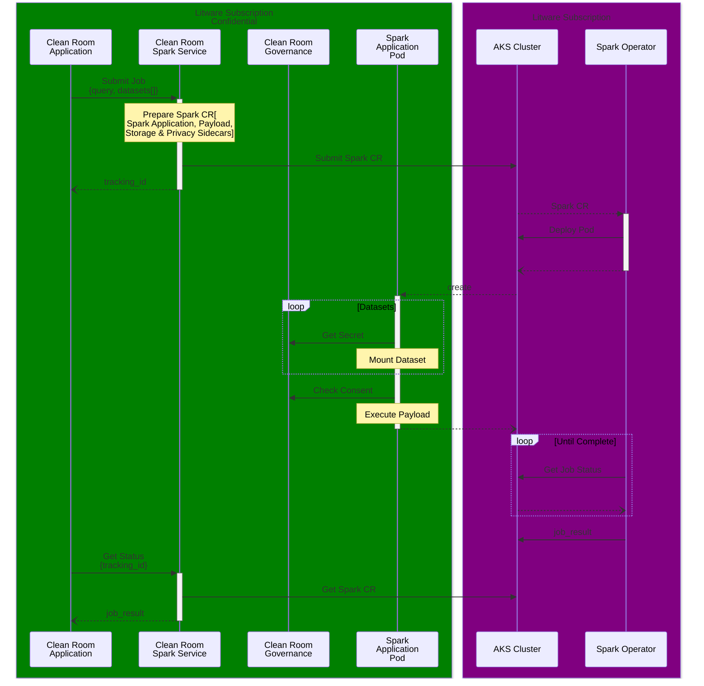

# Execute Workload Sequence Diagrams

Detailed sequence diagrams for interactions between various components as part of executing a workload (running a query).

## Prepare Phase

```mermaid
sequenceDiagram

box purple Contosso Subscription
  participant AKV as Azure Key Vault
end

box green Litware Subscription<br>Confidential
    participant CGS as Clean Room<br>Governance
    participant TEE as Clean Room<br>Application
    participant Spark as Clean Room<br>Spark Service
end

TEE->>CGS: Get users
CGS--)TEE: Users[]
note over TEE: Validate caller is allowed<br>to fetch and execute query

TEE->>CGS: Fetch Query

note over TEE: Validate dataset access & query approvals<br>Check execution consent

TEE->>Spark: Get Attestation Report
Note over TEE: Verify spark

TEE ->> Spark: Get Security Policy<br>{query, datasets[]}
Spark--) TEE: spark_policy[]

note over CGS, Spark: Propagate secrets to Spark Service
loop foreach dataset_secret_id

    alt AKV as Secret Store
        TEE->>AKV: Get Key with SKR(dataset_secret_id, cleanroom_policy)
        AKV--)TEE: dataset_secret
    else CGS as Secret Store
        TEE->>CGS: Get Secret(dataset_secret_id, cleanroom_policy)
        CGS--)TEE: dataset_secret
    end

    loop foreach spark_policy
        TEE->>CGS: Set Secret(dataset_secret, spark_policy)
    end
end

note over CGS, Spark: Configure IDP to issue tokens to Spark Service<br>(for MI federated credential)
loop foreach policy
    TEE->>CGS: Configure IDP(policy)
end

```

## Run Phase

```mermaid
sequenceDiagram

box green Litware Subscription<br>Confidential
    participant TEE as Clean Room<br>Application
    participant Spark as Clean Room<br>Spark Service
    participant CGS as Clean Room<br>Governance
    participant Pod as Spark<br>Application<br>Pod
end

box purple Litware Subscription
    participant AKS as AKS Cluster
    participant SparkOperator as Spark Operator
end

box green Litware Subscription<br>Confidential
end


TEE->>+Spark: Submit Job<br>{query, datasets[]}
note over Spark: Prepare Spark CR[<br>Spark Application, Payload,<br>Storage & Privacy Sidecars]
Spark->>AKS: Submit Spark CR
Spark--)-TEE: tracking_id

AKS-->>+SparkOperator: Spark CR
SparkOperator->>AKS: Deploy Pod
SparkOperator--)-AKS: <br>

AKS-->>+Pod: create
loop Datasets
    Pod->>CGS: Get Secret
    note over Pod: Mount Dataset
end
Pod->>CGS: Check Consent
note over Pod: Execute Payload
Pod--)-AKS: 

loop Until Complete
    SparkOperator->>AKS: Get Job Status
    AKS--)SparkOperator: <br>
end
SparkOperator->>AKS: job_result

TEE->>+Spark: Get Status<br>{tracking_id}
Spark->>AKS: Get Spark CR
Spark--)-TEE: job_result
```
