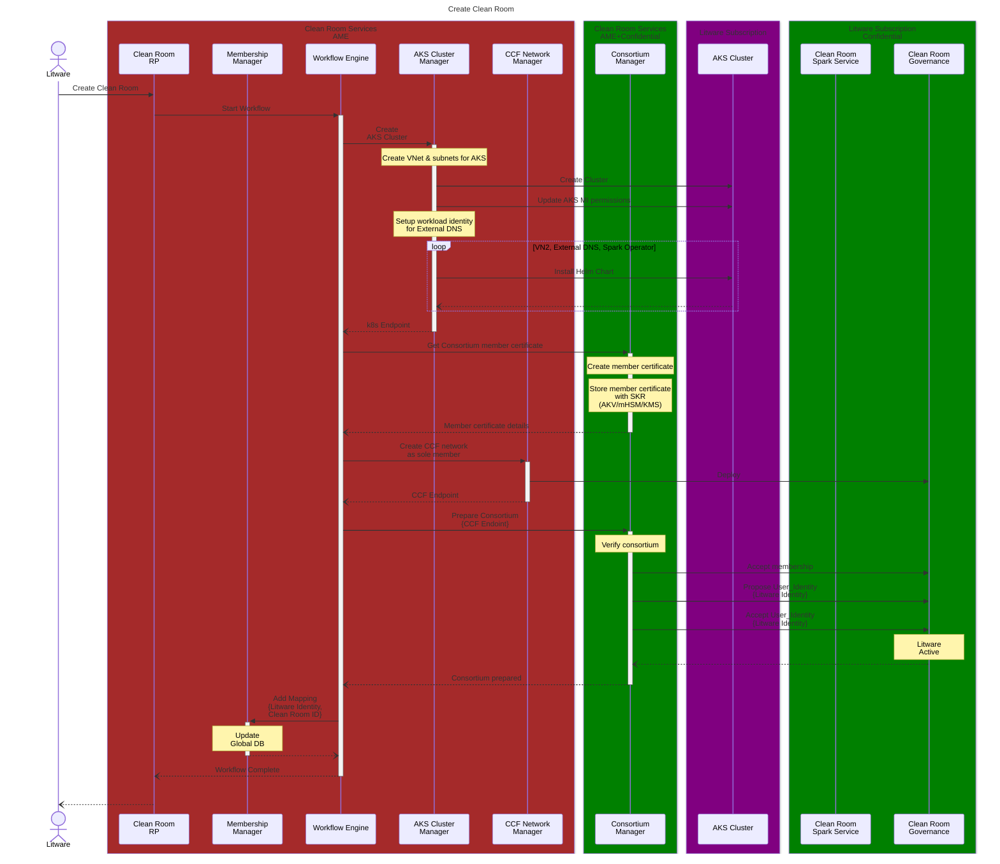
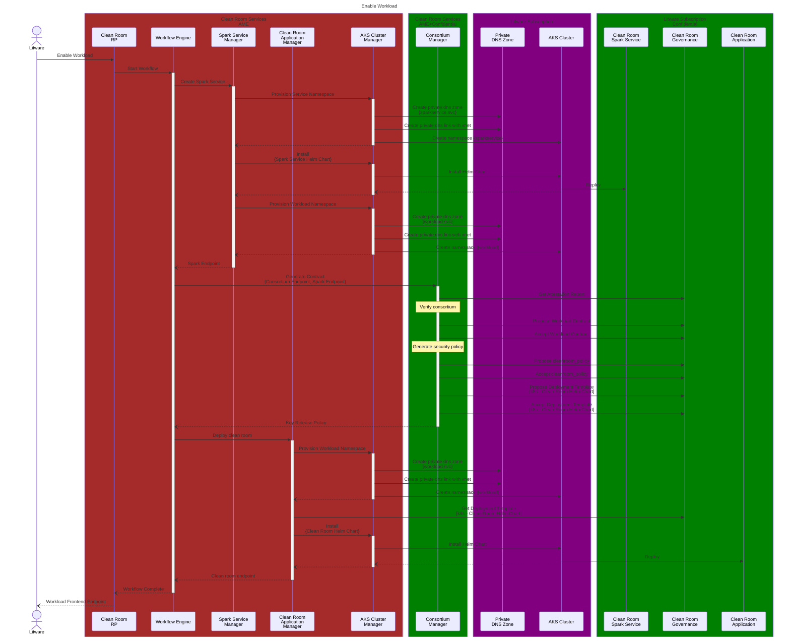
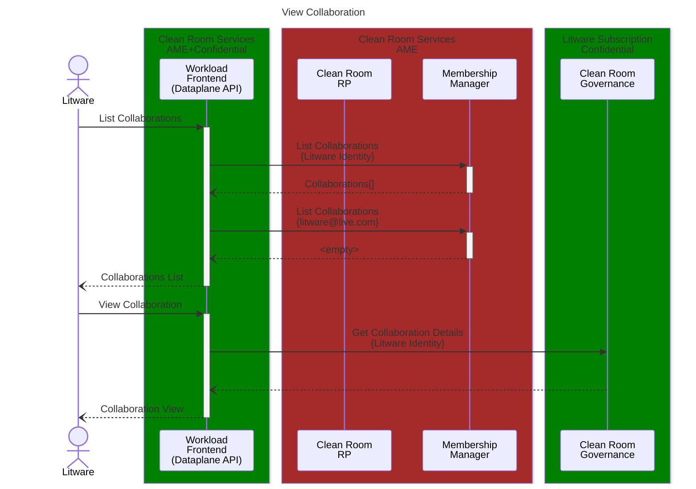
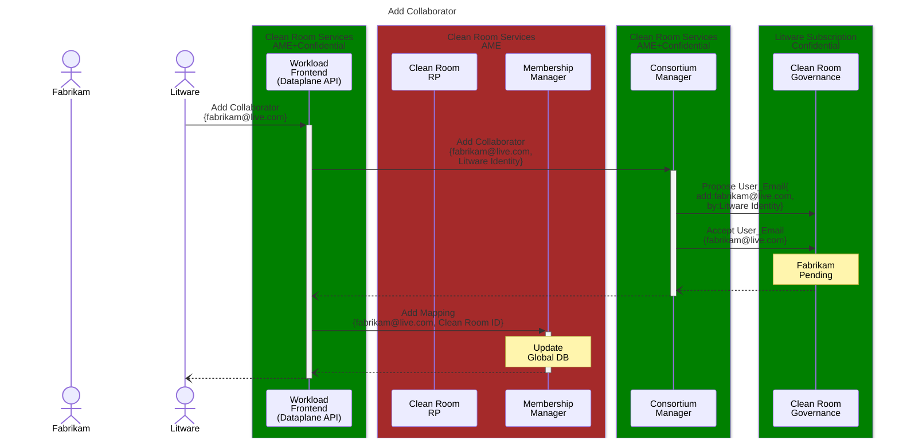
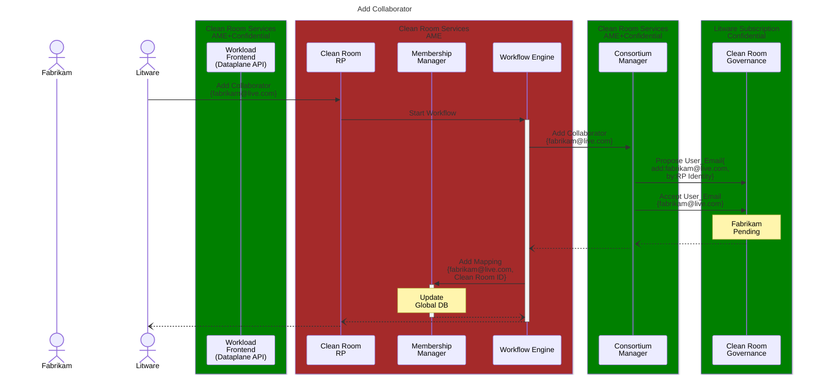
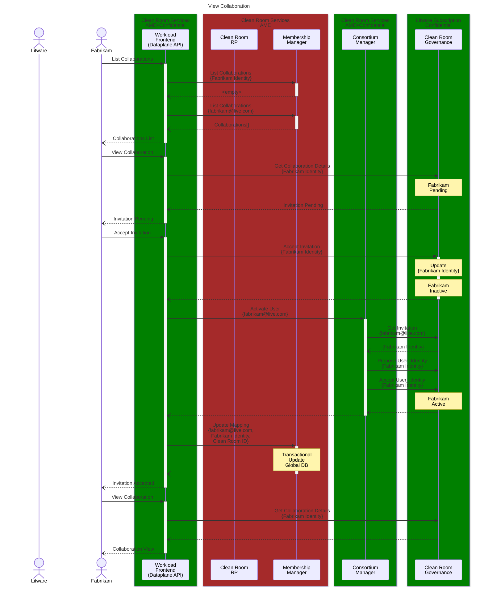

# Initial Setup Sequence Diagrams

Detailed sequence diagrams for interactions between various components as part of the initial setup.

## Create Clean Room

## Enable Workload

## View Collaboration (Owner)

## Add Collaborator (Workload Frontend) - Zero Trust

## Add Collaborator (Clean Room RP) - AME Trust

## View Collaboration (User)

