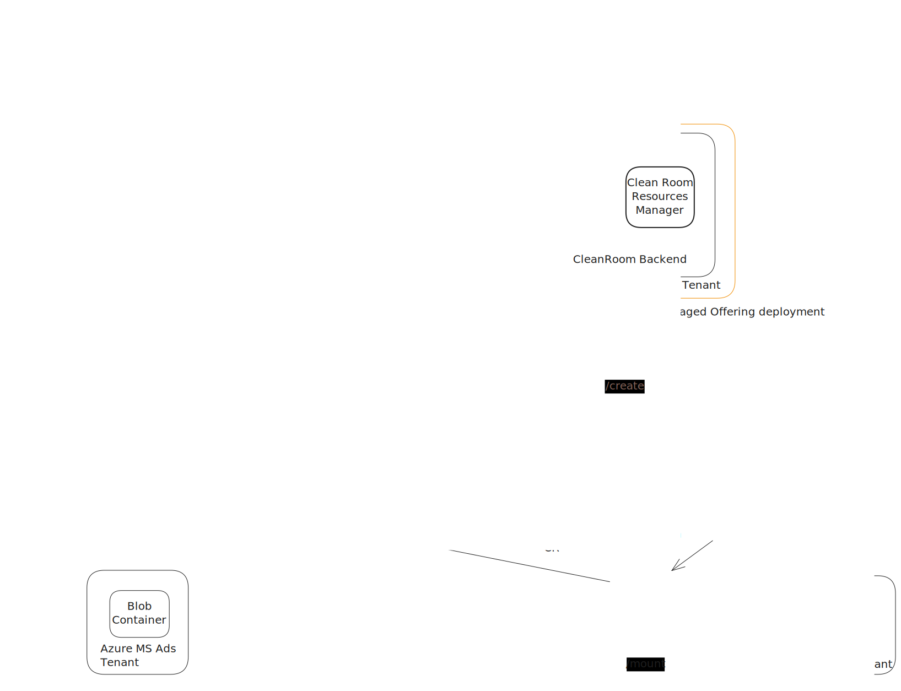

# Spark-based clean rooms
- [Spark-based clean rooms](#spark-based-clean-rooms)
  - [Spark cluster on AKS](#spark-cluster-on-aks)
  - [Key Points](#key-points)
  - [Steps](#steps)
    - [Create (workflow)](#create-workflow)
    - [Prepare (workflow)](#prepare-workflow)
    - [Run (workflow)](#run-workflow)
  - [Spark Cluster Approaches](#spark-cluster-approaches)
    - [Spark cluster on AKS](#spark-cluster-on-aks-1)
    - [Spark Compute in Microsoft Fabric](#spark-compute-in-microsoft-fabric)
- [CGS changes](#cgs-changes)
  - [Contracts management](#contracts-management)
  - [User documents management](#user-documents-management)

## Spark cluster on AKS

*Note: Edit the `aks-spark-layout.excalidraw.svg` file directly in excalidraw VS code extension and diagram 
above will [update automatically](https://github.com/orgs/community/discussions/12216).*
## Key Points
- A Spark cluster is created by using the [Spark Operator](https://www.kubeflow.org/docs/components/spark-operator/overview/) on AKS.
- Spark Operator gives ability to customize the `Spark Executor Pod` [spec](https://github.com/kubeflow/spark-operator/blob/master/docs/api-docs.md#sparkoperator.k8s.io/v1beta2.SparkPodSpec)
  and thus allows us to run the pod on a node pool backed by [CACI based Virtual Nodes (VN2)](https://github.com/microsoft/virtualnodesOnAzureContainerInstances/).
- With the above capability we can get an SNP attestation report for the `Spark Executor Pod` and setup
  Secure Key Release based on the expected `hostData` value of the attestation report.
- Thus we can securely release the secrets required to connect to Azure Blob or S3 bucket storage to only the TEE environment ie `Spark Executor Pod`.
- The Spark infra is hosted in the ISV tenant ie none of the parties that want to collaborate need to host or manage this infra.

## Steps
### Create ([workflow](./workflow.md#creation-phase))
- Creates the CCF instance
- Creates the AKS instance
- Install helm charts for VN2, Spark Operator and External DNS
- Start `Cleanroom Spark Application (CACI)` instance

### Prepare ([workflow](./workflow.md#prepare-phase))
- **Goal**: Accessing storage in participant tenant using Managed Identity
  - Participant sets up MI with federated credentials with CCF IDP endpoint.
  - The MI has access to resources like Azure Storage that the driver/executor pods need access to.
  - The driver/executor pods request ID token from CCF during execution and use that to get MI access token to then access Azure stoarge in participant's account.
  - Setup:
    -  `Cleanroom Spark Application (CACI)` sets clean room policy with the expected `hostData` values for `Spark Driver Pod` and `Spark Executor Pod`.
    -  `blobfuse-launcher` uses `identity sidecar` to get ID token from CCF presenting its attestation report and eventually an access token for the MI.

- **Goal**: Accessing user supplied Secrets to connect to participant resources
  - Participant supplies secrets (such as AWS secret key) which are stored as user secrets in a KMS. This KMS can be a user managed KMS in their own tenant or a `Analytics Client Frontend` managed KMS.
  - This secret is fetched by `s3fs-fuse-launcher` to access S3 bucket in the participant's account.
  - Setup:
    - Secrets are created in user/frontend managed KMS with the expected `hostData` value for `Cleanroom Spark Application (CACI)`.
    - `Cleanroom Spark Application (CACI)` gets the secrets from user/frontend managed KMS presenting its attestation report to fetch the secret.
    - `Cleanroom Spark Application (CACI)` creates secrets in `CGS/KMS (CCF)` service with clean room policy with the expected `hostData` values for `Spark Driver Pod` and `Spark Executor Pod`.
    - `s3fs-fuse-launcher` fetches the secret from CCF presenting its attestation report and using the secret to connect to AWS.

The interactions between the cleanroom components for this step is captured in the workflow [here](./workflow.md#prepare-phase).

### Run ([workflow](./workflow.md#run-phase))
- **Goal**: Start execution of a query on the Spark Pool
  - `Analytics client frontend` invokes the `/run` API exposed by `Cleanroom Spark Application (CACI)` which in turn creates a Spark Job to execute the desired query.

## Spark Cluster Approaches
### Spark cluster on AKS
- As mentioned earlier we get control over the `Spark Executor Pod` definition and can have the pod run on node pools backed by CACI/VN2.
- Thus we are able to get SNP attestation report for the above pod and have an SKR policy for key release of storage secrets that 
  gets consumed either in `analytics.py` or by `blobfuse-launcher` for getting access to the customer storage.
- Clean room users don't deal with a Spark pool/job defintions directly. They only agree upon the queries and the datasets.
  The spark cluster setup happens behind the scenes by the managed cleanroom service (SaaS) offering.
- We have two options of how to access data from the code running in `analytics.py`:
  - Expose data as local mount points using fuse-based file system. Applicable for Azure blob fuse, s3fs fuse
    and any other cloud storage that supports a fuse-based driver to mount storage.
    Code in `analytics.py` access data from local FS mount points.
  - Use native Spark SDK support to connect to storage by providing custom configuration.
    E.g. [connect to Azure Blob storage](https://luminousmen.com/post/azure-blob-storage-with-pyspark/#accessing-data-from-azure-blob-storage):
    ```python
    session.conf.set(
    "fs.azure.account.key.<storage-account-name>.blob.core.windows.net",
    "<your-storage-account-access-key>"
    )
    ```
    Or for [Amazon S3 buckets](https://docs.saagie.io/user/latest/how-to/apache-spark/pyspark-read-write-files-from-amazon-s3):
    ```python
    # Create your SparkSession
    spark = SparkSession.builder \
        .appName("My Application") \
        .config("spark.hadoop.fs.s3a.endpoint", "my-s3.endpoint") \
        .config("spark.hadoop.fs.s3a.impl", "org.apache.hadoop.fs.s3a.S3AFileSystem") \
        .config("fs.s3a.aws.credentials.provider", "com.amazonaws.auth.DefaultAWSCredentialsProviderChain") \
        .config("spark.hadoop.fs.s3a.access.key", s3_access_key) \
        .config("spark.hadoop.fs.s3a.secret.key", s3_secret_key) \
        .getOrCreate()
    ```
    Above approaches require changes in `analytics.py` to support various such storage backends. Further need to look more into whether one
    can make use of secure key release to configure the storage keys/secrets in the spark configs above: perhaps a sidecar can do
    SKR and then write out the keys/secrets in a temp file (within the TEE) which are then accessed in `analytics.py`?
- CACI backed VN2 nodes [don't run](https://github.com/microsoft/virtualnodesOnAzureContainerInstances/blob/main/Docs/PodCustomizations.md#disable-kube-proxy)
  `kube-proxy`. Hence name resolution from executor to driver pods does not work. Alternative is
  to use [External DNS with Azure Private DNS](https://github.com/kubernetes-sigs/external-dns/blob/master/docs/tutorials/azure-private-dns.md#expose-the-nginx-deployment-with-a-load-balancer)
  to resolve a `foo.svc.cloud` name to a service in K8s that has the driver pod behind it. This approach is also being used in the Google Privacy Sandbox effort.

### Spark Compute in Microsoft Fabric
> [!NOTE]
> This approach is at a brainstorming stage, not vetted with any stakeholders (eg Fabric team).

- Clients work with a fully managed [Apache Spark pool](https://learn.microsoft.com/en-us/fabric/data-engineering/spark-compute) operated by MS Fabric.
- Clients create a [Spark Job Definition](https://learn.microsoft.com/en-us/fabric/data-engineering/create-spark-job-definition#create-a-spark-job-definition-for-pyspark-python)
  and schedule runs for it. They author a main defintion file in (say) python and upload it.
- Access to S3 buckets from within the Spark Job should be possible via creating a 
  [shortcut for S3](https://robkerr.ai/creating-an-amazon-s3-shortcut-lakehouse/) in a lakehouse and then accessing it as:
  ```python
  df=spark.read.option("multiline", "true").json("Files/s3_shared_web_reviews/*")
  ```
  Also see [where can I access shorcuts?](https://learn.microsoft.com/en-us/fabric/onelake/onelake-shortcuts#where-can-i-access-shortcuts) page.
- Creating a shortcut requires [supplying access keys/secrets to Fabric ](https://learn.microsoft.com/en-us/fabric/onelake/create-s3-shortcut).
  Not possible to setup a secure key release for S3 storage to only a TEE.
- In this kind of a setup there is no exposure to the underlying compute for the Spark Pools. They can be running on CVMs but still will not 
  be able to provide any per customer attestsation guarantees which can be used to setup any form of secure key release.
- To create a cleanroom offering on top of Fabric Spark:
  - Look into the [data sharing capabilities](https://learn.microsoft.com/en-us/fabric/governance/external-data-sharing-overview) 
    and see how different participants can share data to a common ISV/1P tenant.
    - Open question: Per https://learn.microsoft.com/en-us/fabric/governance/external-data-sharing-overview#considerations-and-limitations 
      "*Shortcuts contained in folders that are shared via external data sharing won't resolve in the consumer tenant.*".
    - Can the [OneLake data sharing link](https://learn.microsoft.com/en-us/fabric/governance/external-data-sharing-create) safely communicated to the cleanroom environment?
  - See if shortcuts to s3 storage needs to be created directly in the ISV/1P tenant and thus participants have to give those details to ISV/1P.
  - Would `Cleanroom Spark Application (CACI)` now invoke the [Spark Job Defintion REST API](https://learn.microsoft.com/en-us/fabric/data-engineering/spark-job-definition-api) to sumbit a job on Fabric Spark?
    - Does that buy us anything?
  - How do we reduce trust in the ISV/1P tenant in such a setup?
  - Can we continue to use CGS as a KMS and keep S3/blob connection details taken from the user and then accessed by `Cleanroom Spark Application (CACI)` to setup the shortcut?
  - Is any kind of `/consentcheck` is possible from analytics.py?


# CGS changes
## Contracts management
Behavior of contracts is updated to support requiring not all but only a subset of consortium members to vote on the contract proposals.

- Contract contains additonal metadata for required approvers:
- If `approvers` is not set then defaults to current behavior of requiring all active members to vote.  
- The `resolve` logic in the CCF constitution will be updated to handle this.
```powershell
# Create a new contract.
$contractId="1221"
$data = '{"metadata": {"voters": {"requiredMembers": [m1, m2]}}}, "properties": {"hello": "world"}}'
az cleanroom governance contract create --data $data --id $contractId

# Update an existing contract.
$version=(az cleanroom governance contract show --id $contractId --query "version" --output tsv)
$data = '{"metadata": {"voters": {"requiredMembers": [m1, m2,m3]}}}, "properties": {"hello": "world", "foo": "bar"}}'
az cleanroom governance contract create --data $data --id $contractId --version $version

# Submitting a contract proposal.
$version=(az cleanroom governance contract show --id $contractId --query "version" --output tsv)
$proposalId=(az cleanroom governance contract propose --version $version --id $contractId --query "proposalId" --output tsv)

# Vote on a contract. As approvers are set only the mentioned members needs to
# vote before the contract gets accepted.
az cleanroom governance contract vote --id $contractId --proposal-id $proposalId --action accept
```

## User documents management
Members: ISV (`m3`)  
Users: Ms Ads (`u1`), AP (`u2`)

- User document contains additonal metadata for required approvers:
- If no `approvers` are mentioned then defaults to all active members are required to approve.
- Current proposal backed (`set_manifest`) manifest implementation will be removed.
- Approvers state managment will be done via the js app.
- Similar to runtime execution consent for approved contracts we'd have runtime execution consent
 for approved documents which can be enabled/disabled by any of the approvers.

document requires no proposal or votes. The approvers accept/reject a document version as follows:
- If no approver has taken any action then its considered `draft`.
- If atleast one approver has accepted then its considered `proposed`.
- If all required approvers have given acceptance then document is considered `accepted`.
- If atleast one approver has rejected then its considered `rejected` even if others accepted.
- document cannot be edited once its moved out of `draft` state.
- For now no ability to go back to `draft` state ie re-edit the document after its proposed/accepted/rejected.

See example usage [here](../src/tools/azure-cli-extension/cleanroom/README.md#user-document-management).