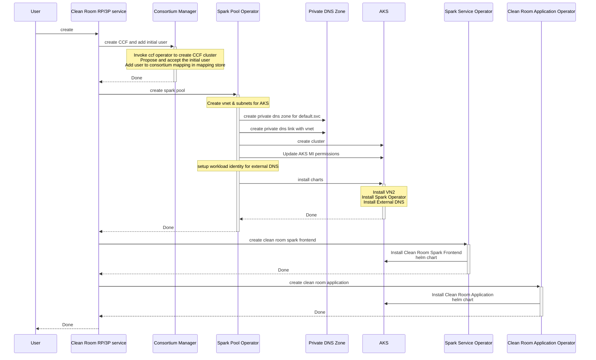
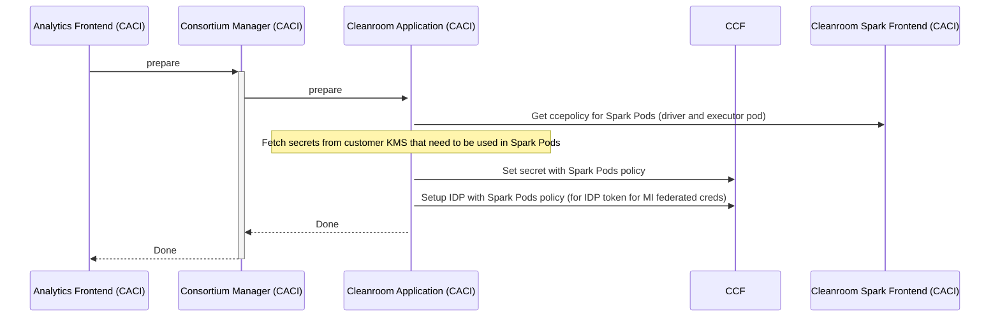
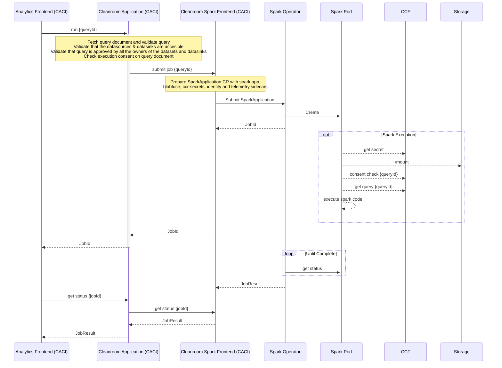

# Spark Clean Room workflows

## Creation phase

```mermaid
sequenceDiagram

participant user as User
participant rp as Clean Room RP/3P service
participant CCF as Consortium Manager
participant sparkprovider as Spark Pool Operator
participant privatednszone as Private DNS Zone
participant AKS
participant sparkservice as Spark Service Operator
participant cleanroomcaci as Clean Room Application Operator

user->>rp: create
rp->>+CCF: create CCF and add initial user
note over CCF: Invoke ccf operator to create CCF cluster <br/> Propose and accept the initial user <br/> Add user to consortium mapping in mapping store
CCF-->>-rp: Done
rp->>+sparkprovider: create spark pool
note over sparkprovider: Create vnet & subnets for AKS
sparkprovider->>+privatednszone: create private dns zone for default.svc
sparkprovider->>+privatednszone: create private dns link with vnet
sparkprovider->>AKS: create cluster
sparkprovider->>AKS: Update AKS MI permissions
note over sparkprovider: setup workload identity for external DNS
sparkprovider->>+AKS: install charts
note over AKS: Install VN2 <br/> Install Spark Operator <br/> Install External DNS
AKS-->>-sparkprovider: Done
sparkprovider-->>-rp: Done
rp->>+sparkservice: create clean room spark frontend
sparkservice->>AKS: Install Clean Room Spark Frontend <br/> helm chart
sparkservice-->>-rp: Done
rp->>+cleanroomcaci: create clean room application
cleanroomcaci->>AKS: Install Clean Room Application <br/>helm chart
cleanroomcaci-->>-rp: Done
rp-->>user: Done
```

## Prepare phase

```mermaid
sequenceDiagram

participant analyticsfrontend as Analytics Frontend (CACI)
participant cleanroomsaasbackend as Consortium Manager (CACI)
participant cleanroomcaci as Cleanroom Application (CACI) 
participant CCF as CCF
participant cleanroomaksfrontend as Cleanroom Spark Frontend (CACI)

analyticsfrontend->>+cleanroomsaasbackend: prepare
cleanroomsaasbackend->>+cleanroomcaci: prepare
cleanroomcaci ->> cleanroomaksfrontend: Get ccepolicy for Spark Pods (driver and executor pod)
note over cleanroomcaci: Fetch secrets from customer KMS that need to be used in Spark Pods
cleanroomcaci->>CCF: Set secret with Spark Pods policy
cleanroomcaci->>CCF: Setup IDP with Spark Pods policy (for IDP token for MI federated creds)
cleanroomcaci-->>cleanroomsaasbackend: Done
cleanroomsaasbackend-->>-analyticsfrontend: Done
```

## Run phase

```mermaid
sequenceDiagram

participant analyticsfrontend as Analytics Frontend (CACI)
participant cleanroomcaci as Cleanroom Application (CACI) 
participant cleanroomaksfrontend as Cleanroom Spark Frontend (CACI)
participant sparkoperator as Spark Operator
participant sparkpod as Spark Pod
participant CCF as CCF

# Run Phase
analyticsfrontend->>+cleanroomcaci: run {queryId}
note over cleanroomcaci: Fetch query document and validate query <br/> Validate that the datasources & datasinks are accesible <br/> Validate that query is approved by all the owners of the datasets and datasinks <br/> Check execution consent on query document
cleanroomcaci->>cleanroomaksfrontend: submit job {queryId}
note over cleanroomaksfrontend: Prepare SparkApplication CR with spark app, <br/> blobfuse, ccr-secrets, identity and telemetry sidecars
cleanroomaksfrontend->>sparkoperator: Submit SparkApplication

sparkoperator-->>+sparkpod: Create
sparkoperator-->>cleanroomaksfrontend: JobId
opt Spark Execution
	sparkpod-->>CCF: get secret
	sparkpod-->>Storage: /mount
	sparkpod-->>CCF: consent check {queryId}
	sparkpod-->>CCF: get query {queryId}
	sparkpod-->>sparkpod: execute spark code
end
cleanroomaksfrontend-->>cleanroomcaci: JobId
cleanroomcaci-->>-analyticsfrontend: JobId
loop Until Complete
	sparkoperator->>sparkpod: get status
end
sparkoperator-->>cleanroomaksfrontend: JobResult
analyticsfrontend->>cleanroomcaci: get status {jobId}
cleanroomcaci->>cleanroomaksfrontend: get status {jobId}
cleanroomaksfrontend-->>cleanroomcaci: JobResult
cleanroomcaci-->>analyticsfrontend: JobResult

```