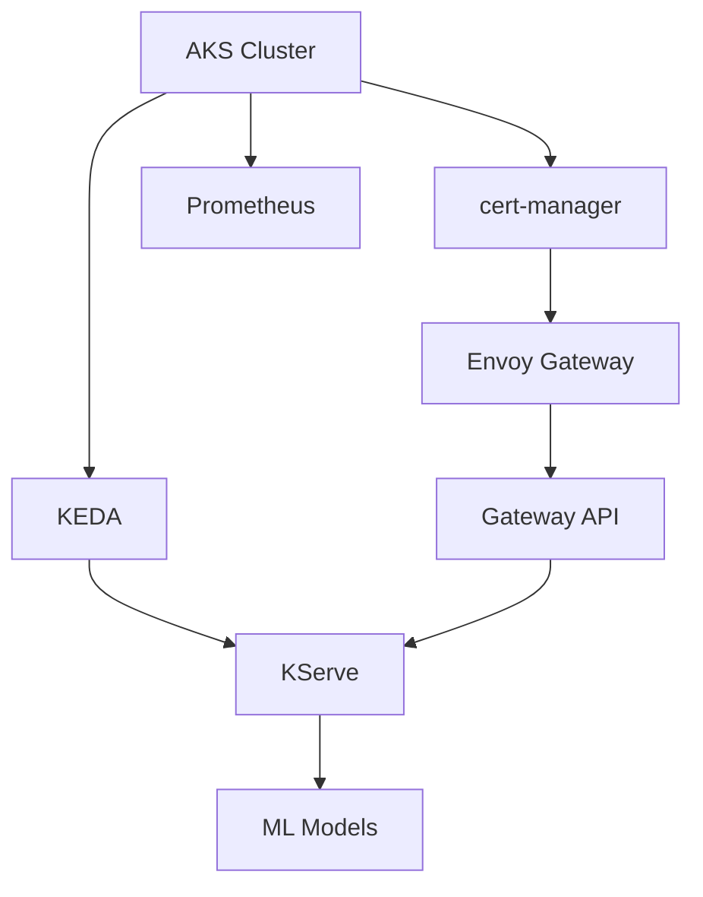

# KServe ML Platform: Pain Points & Issues Summary

This document summarizes all the significant pain points, issues, and challenges encountered while developing the Bicep ML inference platform using KServe on Azure Kubernetes Service.

## Overview

The development of this ML inference platform involved translating manual KServe installation guides into automated Infrastructure as Code (Bicep) templates. This process revealed numerous environment compatibility issues, dependency management challenges, and documentation gaps that required extensive troubleshooting and iterative solutions.

---

## 1. KServe Installation Guide Translation Complexity

### Problem
Converting manual KServe installation guides into automated Bicep templates was significantly more complex than anticipated.

### Specific Challenges
- **Documentation Gap**: KServe documentation primarily focuses on manual kubectl/Helm installation steps, not Infrastructure as Code approaches
- **Multi-step Dependencies**: Complex dependency chain requiring careful orchestration:
  ```
  AKS → cert-manager/KEDA → Envoy Gateway → Gateway API → KServe → ML Models
  ```
- **Helm Configuration Translation**: Converting complex Helm `--set` arguments into Bicep parameters
- **Version Compatibility**: Understanding which versions of components work together
- **Gateway API Integration**: Configuring KServe to work with Gateway API instead of Istio (default documentation)

### Impact
- Extended development time for research and understanding
- Multiple iterations to get the configuration correct
- Required deep diving into KServe source code and examples

### Solution Applied
- Created modular Bicep architecture with proper dependency management
- Extracted reusable `helm-chart.bicep` module for consistent Helm deployments
- Documented the complete dependency chain and sequencing requirements

---

## 2. Azure Deployment Script Environment Limitations

### Problem
Azure CLI container environments used by deployment scripts lack essential Linux tools required by installation scripts.

### Specific Issues Encountered

#### Missing `tar` Utility
```bash
# Error from Helm installation script:
curl https://raw.githubusercontent.com/helm/helm/main/scripts/get-helm-3 | bash
# Failed with: tar: command not found
```

#### Missing `awk` Utility  
```bash
# Helm scripts failed due to missing text processing tools
# Multiple scripts required awk for parsing and text manipulation
```

#### Package Manager Limitations
- `apt-get` not available or unreliable in Azure deployment script containers
- Standard package installation methods don't work
- Container environments are minimal and locked down

### Impact
- Deployment scripts failed consistently across different Azure regions
- Blocked deployment progress until environment issues were resolved
- Required alternative tool installation strategies

### Solution Applied
**BusyBox Static Binary Approach:**
```bash
# Install required tools using BusyBox static binaries
echo "Installing tar and awk (required for Helm)..."
curl -L https://busybox.net/downloads/binaries/1.35.0-x86_64-linux-musl/busybox -o /usr/local/bin/busybox
chmod +x /usr/local/bin/busybox
ln -sf /usr/local/bin/busybox /usr/local/bin/tar
ln -sf /usr/local/bin/busybox /usr/local/bin/awk
export PATH="/usr/local/bin:$PATH"
```

---

## 3. Complex Dependency Management

### Problem
Managing the complex dependency chain between Kubernetes components proved challenging in Bicep.

### Dependency Complexity


### Specific Challenges
- **Parallel vs Sequential**: Determining which components can deploy in parallel vs requiring sequence
- **Wait Conditions**: Ensuring resources are fully ready before dependent deployments
- **Resource Identity**: Managing shared managed identity across all deployment scripts
- **Helm Chart Timing**: Some Helm charts require specific readiness conditions

### Issues Encountered
- Race conditions between parallel deployments
- Premature dependency deployment causing failures
- Resource not ready errors
- Inconsistent deployment success rates

### Solution Applied
**Structured Dependency Management:**
```bicep
// Proper Bicep dependency declaration
module kserve 'modules/kserve.bicep' = {
  name: 'kserve-deployment'
  params: { /* parameters */ }
  dependsOn: [
    gatewayApi  // Explicit dependency
    keda       // Explicit dependency
  ]
}
```
- Explicit `dependsOn` declarations in Bicep
- Kubernetes wait conditions in deployment scripts
- Proper resource readiness checks before proceeding

---

## 4. Helm Repository and Chart Management Issues

### Problem
Different Helm chart repositories (traditional vs OCI) required different handling approaches.

### Specific Issues
```bash
# Traditional repository approach:
helm repo add keda https://kedacore.github.io/charts
helm repo add prometheus-community https://prometheus-community.github.io/helm-charts

# vs OCI repository approach:
helm install kserve oci://ghcr.io/kserve/charts/kserve
```

### Complications
- Mixed repository types across different components
- Different authentication requirements
- Varying chart structure and values format
- Repository update timing and caching issues

### Solution Applied
**Flexible Repository Handling:**
```bicep
// Generic helm-chart.bicep with conditional logic
repositoryType: 'traditional' // or 'oci'
repositoryUrl: repoUrl
chartName: chartName
```
- Created flexible helm-chart module supporting both repository types
- Standardized chart installation process
- Proper repository management and updates

---

## 5. Deployment Progress Visibility Issues

### Problem
Limited visibility into deployment progress made debugging and troubleshooting difficult.

### Original Limitations
- Only top-level Azure resource deployment status visible
- No insight into nested Bicep module progress
- No visibility into Helm chart installation progress
- Difficult to identify which specific component was failing

### Impact
- Long deployment times without progress indicators
- Difficult to pinpoint failure locations
- Poor user experience during deployments
- Complex troubleshooting process

### Solution Applied
**Enhanced Progress Tracking:**
```powershell
# Enhanced deployment status output
[12:34:56] aks-cluster-deployment (Microsoft.Resources/deployments): Running
[12:34:57]   └─ helm-install-cert-manager (Child Deployment): Running  
[12:34:58]   └─ helm-install-keda (Child Deployment): Succeeded
[12:34:59]   └─ helm-install-kserve (Child Deployment): Running
```
- Added child deployment visibility
- Implemented hierarchical progress display
- Real-time status updates for all components

---

## 6. Character Encoding and Unicode Issues

### Problem
Unicode characters and emojis in deployment scripts caused failures in certain Azure environments.

### Specific Failures
```bash
# Original (failed in some environments):
echo "🔐 Getting AKS credentials..."
echo "📦 Installing Gateway API CRDs..."
echo "✅ Installation completed!"

# Error: Invalid character encoding or display issues
```

### Impact
- Deployment failures in certain Azure regions or container environments
- Inconsistent behavior across different terminal environments
- Poor user experience with garbled output

### Solution Applied
**Complete ASCII Standardization:**
```bash
# Fixed (working everywhere):
echo "Getting AKS credentials..."
echo "Installing Gateway API CRDs..."
echo "Installation completed!"
```
- Removed all unicode/emoji characters from all Bicep deployment scripts
- Standardized to plain ASCII text only
- Improved compatibility across different environments

---

## 7. Documentation and Knowledge Transfer Issues

### Problem
Lack of comprehensive Infrastructure as Code documentation for KServe deployments.

### Specific Gaps
- **Manual vs IaC**: Most documentation focuses on manual installation
- **Azure-specific**: Limited Azure Kubernetes Service specific guidance
- **Troubleshooting**: Poor troubleshooting documentation for automated deployments
- **Best Practices**: Missing IaC best practices for ML platforms

### Impact
- Extended research time to understand component interactions
- Trial and error approach for configuration
- Difficulty in knowledge transfer to team members
- Poor onboarding experience for new developers

### Solution Applied
**Comprehensive Documentation:**
- Created detailed README with step-by-step instructions
- Documented all pain points and solutions (this document)
- Added troubleshooting guides with specific commands
- Included architectural diagrams and dependency explanations

---

## 8. Testing and Validation Challenges

### Problem
Limited built-in testing and validation mechanisms for deployed ML inference platform.

### Specific Issues
- No automated validation of KServe installation
- No built-in model deployment testing
- Manual verification process was error-prone
- Difficult to validate end-to-end functionality

### Impact
- Deployments appeared successful but weren't functional
- Manual testing required deep Kubernetes knowledge
- Poor developer experience for validation

### Solution Applied
**Automated Testing Script:**
```powershell
# deploy-iris.ps1 - Automated model deployment and testing
./deploy-iris.ps1 -TestModel
```
- Created automated model deployment script
- Built-in validation and testing capabilities
- Sample data generation and testing guidance
- Clear success/failure indicators

---

## Summary of Key Lessons Learned

### 1. Environment Assumptions Are Dangerous
- **Cannot assume tools are available** in deployment environments
- **Test in minimal containers** that match production deployment environments

### 2. Version Standardization Is Critical  
- **Mixed tool versions cause compatibility issues**
- **Standardize early** and maintain consistency across all components
- **Document version compatibility matrices**

### 3. Dependency Orchestration Requires Planning
- **Map all dependencies before implementation**
- **Use explicit dependency declarations** in Infrastructure as Code
- **Implement proper wait conditions** for resource readiness

### 4. Documentation Gaps Are Real
- **Manual installation guides ≠ IaC implementation guides**
- **Create IaC-specific documentation** alongside existing resources
- **Document common pitfalls and solutions** for future reference

### 5. User Experience Matters
- **Progress visibility** is crucial for complex deployments
- **Enhanced error handling** reduces frustration
- **Automated testing** improves confidence in deployments

---

## Time Investment Analysis

| Phase | Percentage | Activities |
|-------|------------|------------|
| **Research** | 25% | Understanding KServe ecosystem, dependencies, Gateway API integration |
| **Translation** | 30% | Converting manual guides to Bicep, parameter mapping, dependency modeling |
| **Debugging** | 25% | Environment issues, tool availability, character encoding, version conflicts |
| **Refinement** | 15% | Error handling, parameter management, documentation, user experience |
| **Enhancement** | 5% | Progress tracking, automated testing, troubleshooting guides |

**Total Development Time**: Significantly longer than anticipated due to the complexity of translating manual processes into reliable Infrastructure as Code.

---
