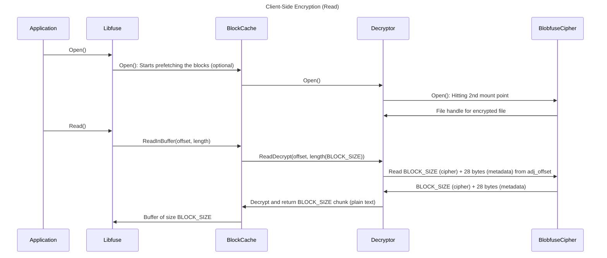
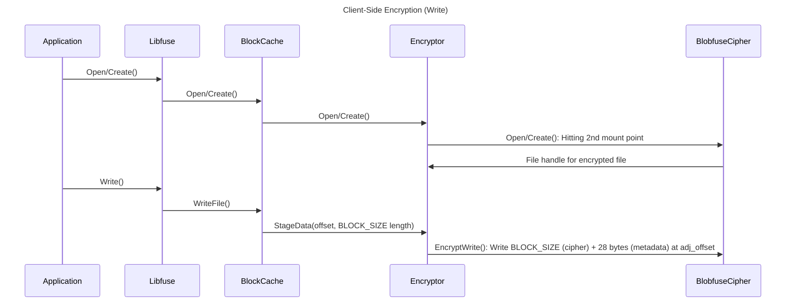

# AES Encryptor invocation sample from Python
A go module that exposes `EncryptChunk` and `DecryptChunk` method to showcase how to invoke the same from Python via the `az cleanroom` cli. To try this sample follow the below steps:
```powershell
$root=$(git rev-parse --show-toplevel)
cd $root/src/tools/aes_encryptor

# Build aes_encryptor.so
go build -o aes_encryptor.so -buildmode=c-shared aes_encryptor.go

# Drop aes_encryptor.so into the binaries folder and build to pack it in with the cli extension.
mv ./aes_encryptor.so $root/src/tools/azure-cli-extension/cleanroom/azext_cleanroom/binaries
../../../build/build-azcliext-cleanroom.ps1

```

## Links
- https://medium.com/analytics-vidhya/running-go-code-from-python-a65b3ae34a2d
- https://fluhus.github.io/snopher/


# Running Encryptor Plugin with Azure-Storage-Fuse
The Encryptor module is responsible for enabling client-side encryption with Blobfuse. This plugin will be loaded as a component in Blobfuse via the custom component feature. To generate the encryptor .so, follow the steps below:
```powershell
$root=$(git rev-parse --show-toplevel)
cd $root/src/blobfuse-launcher

# Move the encryptor plugin to Azure-Storage-Fuse
mv ./encryptor $root/external/azure-storage-fuse/

cd $root/external/azure-storage-fuse

# Build the Encryptor plugin
go build -o encryptor.so -buildmode=plugin encryptor.go

```
# Client-Side Encryption

## Functional Requirement
The goal of client-side encryption is to ensure that data leaving the clean room is encrypted (ciphertext) and can only be decrypted within the clean room with the key it was encrypted with.

## Overview
The proposed solution integrates encryption support within Blobfuse using a **two-mount approach**. This approach combines metadata with ciphertext, ensuring that only a single encrypted file is used.
The client-side encryption mechanism employs a two-mount approach to handle data securely. This approach involves:
- The first mount point processes plain text and is not backed by storage.
- The second mount point is backed by a storage component and processes ciphertext.
Currently, the `BLOCK_SIZE` used for the block cache is 16MB. This value is configurable and can be adjusted based on performance and resource requirements.

---

## Read Flow

1. The **first mount point** is backed by a block cache, which is configured with a customizable `BLOCK_SIZE`.
2. For every `Read` operation:
   - The file handle is retrieved from the **second mount point**.
   - A prefetch flag in the block cache enables chunk reading to begin during the `Open()` call.
3. **Libfuse** invokes the `ReadInBuffer()` method on the block cache, specifying an arbitrary buffer size (up to a maximum of the `BLOCK_SIZE`).
4. The block cache, configured with a `BLOCK_SIZE`, calls the `ReadInBuffer()` method of the **Decryptor** in chunks of the `BLOCK_SIZE` (except for the final chunk, which may be smaller).
5. The **Decryptor** performs the following actions:
   - Reads the ciphertext (`BLOCK_SIZE`) along with 28 bytes of metadata from the **second mount point (Blobfuse-Cipher)**.
   - Decrypts the ciphertext and returns a plain text chunk of the `BLOCK_SIZE` to the block cache.
6. The block cache delivers the decrypted plain text buffer to **Libfuse**, completing the read operation.


---

### Sequence Diagram


---

## Write Flow
1. **Libfuse** invokes writes to the block cache with a buffer of arbitrary size (up to the `BLOCK_SIZE`).
2. The block cache starts uploading blocks marked as dirty after a certain number of blocks are written.
3. For each chunk of the `BLOCK_SIZE`:
   - The block cache invokes `StageData()` of the **Encryptor**.
   - The **Encryptor**:
     - Encrypts the chunk of the `BLOCK_SIZE`.
     - Writes the ciphertext (`BLOCK_SIZE`) along with metadata (28 bytes) to the **second mount point (Blobfuse-Cipher)** at the adjusted offset corresponding to the chunk.

---

### Sequence Diagram


---

## Encryption/Decryption Details
- **Algorithm**: AES-GCM
- **Metadata**:
  - **Nonce (12 bytes)**: A unique nonce is used for each chunk.
  - **Authentication Tag (16 bytes)**: Ensures data integrity.
- **Ciphertext Structure**:
  - Each chunk is stored as `BLOCK_SIZE + 28 bytes` (ciphertext + metadata).
- **Decryption**:
  - To decrypt a chunk, `BLOCK_SIZE + 28 bytes` of data is read from the **second mount point**.

---

## Debugging
If you encounter issues during the encryption or decryption process, follow these steps to debug:

  **Check Logs**:
   - Logs can be found in the path specified by the `log-file-path` parameter in the Blobfuse configuration.
   - Ensure that you review logs for both mount points:
     - The **encryptor-backed mount point**.
     - The **storage-backed mount point**.
   - Identify which mount point is propagating the error. This will help determine whether the issue originates from Blobfuse itself or from the custom encryptor code.


## Performance Results

### Test Environment
- **Blobfuse Version**: 2.4.2 with Client-Side Encryption (CSE) enabled.
- **Storage Account Type**: Standard_LRS.
- **Compute Environment**: Azure Container Instance (ACI) with 8 CPUs and 16GB RAM.


### Results

#### Write
| Operation                     | Throughput (MiB/s) | Latency (ms) |
|-------------------------------|--------------------|--------------|
| Sequential Write              | 70.14             | 3.57         |
| Sequential Write (Direct IO)  | 68.26             | 3.67         |
| Sequential Write (4 Threads)  | 89.19             | 11.21        |

#### Read
| Operation                     | Throughput (MiB/s) | Latency (ms) |
|-------------------------------|--------------------|--------------|
| Sequential Read               | 60.98             | 4.12         |
| Random Read                   | 0.45              | 650.19       |
| Sequential Read (Direct IO)   | 75.81             | 3.32         |
| Random Read (Direct IO)       | 0.46              | 589.43       |
| Sequential Read (4 Threads)   | 272.73            | 3.67         |
| Random Read (4 Threads)       | 0.36              | 3208.62      |

---