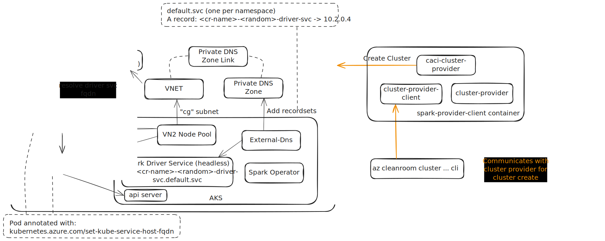

# Clean Room clusters <!-- omit from toc -->
- [1. Introduction](#1-introduction)
- [2. Cluster on CACI/VN2 environment](#2-cluster-on-cacivn2-environment)
- [3. Quickstart: cluster creation](#3-quickstart-cluster-creation)
- [4. Step by step cluster creation](#4-step-by-step-cluster-creation)

## 1. Introduction
The infra provided here enables creation of a Clean Room clusters on top of Azure Confidential Computing offerings such as on AMD SEV-SNP using Confidential ACI (CACI). The following capabilities are enabled:
  - Create a clean room cluster that can run Spark jobs using the Spark Operator with the driver/executor pods running on CACI/VN2.

## 2. Cluster on CACI/VN2 environment


## 3. Quickstart: cluster creation
To simply get going and play around with a clean room cluster run the below command:
```powershell
$clusterName = "<your-network-name>"
$resourceGroup = "<an-existing-rg-name>"

az cleanroom cluster up --name $clusterName --resource-group $resourceGroup
```

## 4. Step by step cluster creation
Below are the steps to create a clean room cluster with more granular control over the process of
 cluster creation. The `cleanroom cluster up` command automates the flow below to give a simplified
 experience.

```powershell
$sandbox_common = "cleanroom-cluster-operator"
mkdir -p $sandbox_common
if (!(Test-Path "$sandbox_common/uniqueString.txt")) {
    $uniqueString = $((New-Guid).ToString().Substring(0, 8))
    $uniqueString | Out-File "$sandbox_common/uniqueString.txt"
}

$location = "centralindia"
$uniqueString = Get-Content "$sandbox_common/uniqueString.txt"
$resourceGroup = "cr-cluster-deploy-$uniqueString"
Write-Output "Resource group: $resourceGroup"

$clusterName = "my-cr-cluster"
$subscriptionId = az account show --query "id" -o tsv
$tenantId = az account show --query "tenantId" -o tsv

az group create --name $resourceGroup --location westeurope
@"
{
    "location": "$location",
    "subscriptionId": "$subscriptionId",
    "resourceGroupName": "$resourceGroup",
    "tenantId": "$tenantId"
}
"@ >  $sandbox_common/providerConfig.json

az cleanroom cluster provider deploy

az cleanroom cluster create `
    --name $clusterName `
    --enable-analytics-workload `
    --provider-config $sandbox_common/providerConfig.json
```