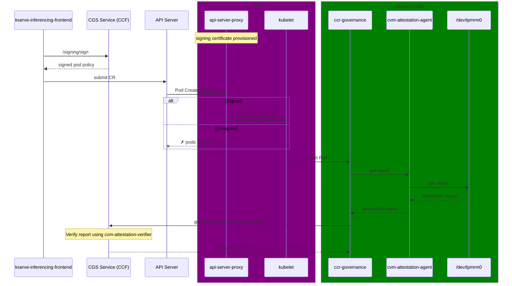

# CVM Architecture

```mermaid
sequenceDiagram
    participant FE as kserve-inferencing-frontend
    participant CGS as CGS Service (CCF)
    participant API as API Server
    box purple CVM
        participant KP as api-server-proxy
        participant K as kubelet
    end
    box green Pod (in CVM)
        participant GOV as ccr-governance
        participant ATT as cvm-attestation-agent
        participant TPM as /dev/tpmrm0
    end

    Note over KP: signing certificate provisioned
    FE->>CGS: /signing/sign
    CGS-->>FE: signed pod policy
    FE->>API: submit CR
    API->>KP: Pod Create Request
    alt Signed
        KP->>K: ✓ forward to kubelet
    else Unsigned
        KP--xAPI: ✗ pods rejected
    end
    K->>GOV: start Pod
    GOV->>ATT: get report
    ATT->>TPM: get report
    TPM-->>ATT: attestation report
    ATT-->>GOV: attestation report
    GOV->>CGS: get oauth-token (attestation report)
    Note over CGS: Verify report using cvm-attestation-verifier
    CGS-->>GOV: outh-token
```