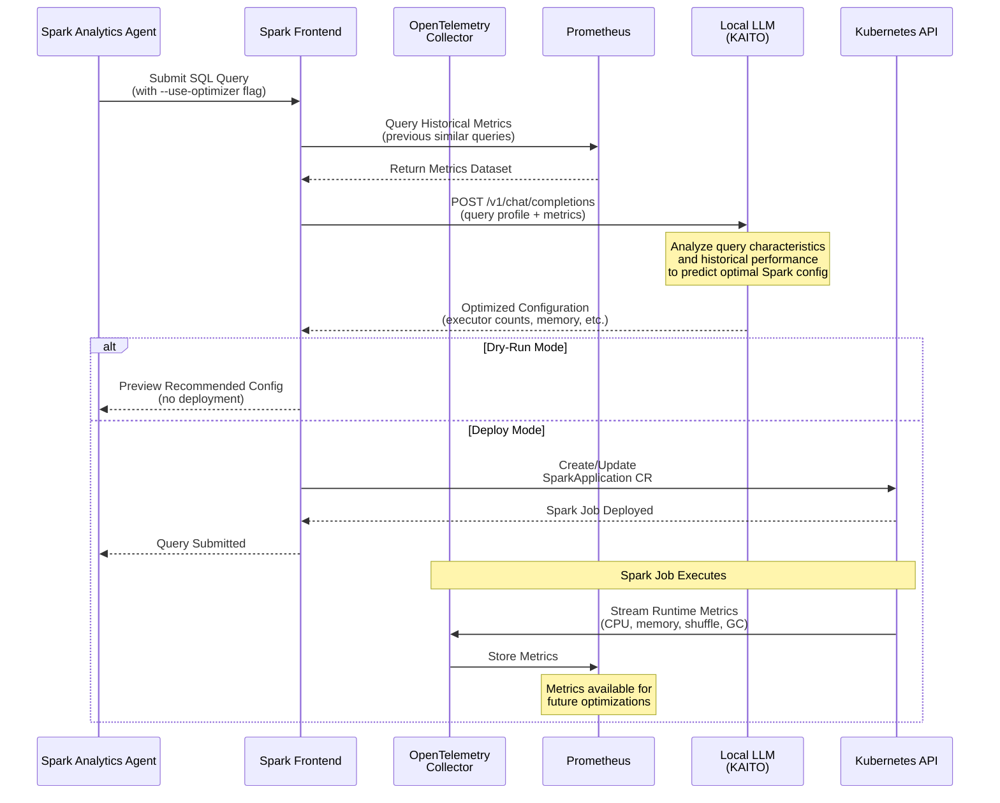

# AI-Powered Workload Optimization Using Local LLM Deployment

## Architecture Overview

The cleanroom cluster infrastructure deploys an open-source LLM model (Llama 3.1 8B
Instruct) locally within the same Kubernetes cluster (AKS or Kind) using
**[KAITO](https://github.com/Azure/kaito) (Kubernetes AI Toolchain Operator)** to
deploy the model image provided by **[AIKit](https://github.com/sozercan/aikit)**.
AIKit is powered by **[LocalAI](https://github.com/mudler/LocalAI)**, an open-source
project that provides OpenAI-compatible API endpoints for running LLMs locally without
requiring GPU infrastructure. This model serves as an AI optimizer that analyzes workload
requirements and provides intelligent recommendations for configuring **Spark analytics
workloads**. Future enhancements can extend this capability to **KServe inferencing
workloads**, including their autoscaling and resource management configurations.

## Motivation: Why Local LLM Infrastructure?

### The Privacy and Security Challenge with Public AI Services

When using public AI services like OpenAI, Anthropic Claude, Google Gemini, or Azure
OpenAI, organizations face several critical challenges:

- **Data Exfiltration Risk**: Every API call to external AI services transmits workload
  metadata, query patterns, dataset characteristics, and performance metrics outside the
  organizational boundary. Even if the prompt content is not stored, the metadata itself
  can reveal sensitive business intelligence.

- **Regulatory Compliance Concerns**: Industries such as healthcare (HIPAA), finance
  (PCI-DSS, SOX), and government sectors face strict regulations prohibiting transmission
  of sensitive data to third-party services, even for AI-powered optimization.

- **Trust Boundary Violation**: Cleanroom environments are designed around zero-trust
  principles where data remains within attested, isolated compute environments. External
  API calls fundamentally violate this trust boundary.

- **Vendor Lock-in and Availability**: Dependence on external AI providers creates
  operational risks including service outages, rate limiting, pricing changes, and
  potential discontinuation of services.

- **Network Latency**: Round-trip latency to external APIs can add hundreds of
  milliseconds to optimization decisions, impacting real-time workload scheduling.

### Benefits of Local LLM Infrastructure

Deploying AI models locally within the cleanroom cluster addresses these challenges and
provides significant advantages:

**1. Complete Data Sovereignty**
- All workload metadata, performance metrics, and optimization decisions remain within
  the Kubernetes cluster boundary
- No external network calls required for AI inference
- Full control over data lifecycle and retention policies

**2. Confidential Computing Alignment**
- LLM inference occurs within the same attested, isolated environment as the workloads
- Hardware-based attestation (AMD SEV-SNP, Intel TDX) can be extended to the AI optimization
  layer
- End-to-end confidentiality from data ingestion through AI-powered configuration

**3. Auditability and Compliance**
- All AI decisions are traceable within the cluster's observability stack
- No external dependencies simplify compliance certification (FedRAMP, ISO 27001, etc.)
- Complete transparency into model versions, prompts, and responses

**4. Cost Predictability**
- Fixed infrastructure costs instead of variable API pricing
- No per-token charges for optimization queries
- Economies of scale as workload volume increases

**5. Performance and Reliability**
- Sub-millisecond latency for inference calls (cluster-internal networking)
- No external service dependencies or rate limits
- Optimization decisions remain available even during internet outages

**6. Customization and Fine-Tuning**
- Models can be fine-tuned on organization-specific workload patterns
- Custom RAG pipelines built from internal historical data
- No restrictions on model modifications or training data

**7. CPU-Only Model Support (No GPU Required)**
- KAITO/AIKit leverage LocalAI's CPU-optimized inference for models like Llama 3.1 8B
  Instruct
- Eliminates the need for expensive GPU nodes in the cluster infrastructure
- Customers can adopt AI/LLM capabilities using standard CPU-only node pools
- Significantly lowers the barrier to entry for AI-powered workload optimization
- Reduced infrastructure costs and simplified cluster management
- Still provides intelligent optimization with acceptable inference latency for
  configuration decisions (which are not latency-critical like real-time inference)

### Alignment with Cleanroom Principles

The cleanroom framework is built on the premise that sensitive data processing should
occur in isolated, attested environments with minimal external dependencies. By deploying
LLM infrastructure locally:

- **Zero External Dependencies**: AI optimization becomes a self-contained capability
- **Attestable AI**: The entire AI inference pipeline can be made part of the attested TCB
  (Trusted Computing Base)
- **Privacy-Preserving Intelligence**: AI-driven optimizations enhance performance
  without compromising confidentiality
- **Governance Integration**: AI decisions can be subject to the same CCF-based
  governance as data processing workloads

This approach transforms AI from a potential privacy liability into a trusted component
of the confidential computing infrastructure.

### Data Flow for AI-Powered Optimization



## Key Components

1. **Local LLM Deployment via KAITO/AIKit**
   - Model: Llama 3.1 8B Instruct (8-billion parameter instruction-tuned model)
   - Deployment mechanism: [KAITO](https://github.com/Azure/kaito) workspace resources
     in Kubernetes
   - Model images: Provided by [AIKit](https://github.com/sozercan/aikit), powered by
     [LocalAI](https://github.com/mudler/LocalAI)
   - Accessibility: Exposed as a service within the cluster with OpenAI-compatible API
     (e.g., `workspace-llama-3point1-8b-instruct.kaito-workspace:80`)

2. **Integration with Spark Frontend**
   - The frontend queries the local LLM for optimal Spark configurations
   - Parameters like `useOptimizer` and `dryRun` control when to invoke the AI optimizer
   - LLM analyzes query characteristics, dataset sizes, resource constraints, and historical performance metrics

3. **Configuration Optimization Flow**
   ```
   Current:  SQL Query → Agent/Frontend → Local LLM → Optimized SparkApplication CR
   Future:   Inference Request → KServe Agent → Local LLM →
             Optimized KEDA ScaledObject + InferenceService
   ```

4. **OpenTelemetry Metrics Integration**
   - **Metrics Collection**: OpenTelemetry Collector deployed in the cluster captures
     real-time metrics from Spark workloads
   - **Current Data Sources**:
     - **Spark Metrics**: Executor utilization, shuffle data volumes, task completion
       times, memory pressure, GC overhead
   - **Future Data Sources** (for KServe integration):
     - **KServe Metrics**: Inference request rates, latency percentiles (p50, p95, p99),
       batch sizes, model loading times, GPU utilization
   - **Feedback Loop**: Historical metrics feed into the LLM's optimization engine to
     refine future configuration recommendations
   - **Adaptive Learning**: As workloads execute, the LLM learns patterns and adjusts
     recommendations based on observed performance vs. predicted configurations

## Privacy and Security Advantages

**Critical Benefit: Data Sovereignty and Zero Data Exfiltration**

By deploying the LLM model locally within the same cluster where workloads execute:

- **No External API Calls**: Unlike cloud-based AI services (OpenAI, Azure OpenAI,
  etc.), no query metadata or workload characteristics leave the cluster perimeter
- **Confidential Computing Alignment**: Perfectly aligns with cleanroom principles
  where data processing occurs in isolated, attested environments
- **Network Isolation**: The LLM inference endpoint is cluster-internal, eliminating
  exposure to internet-based threats
- **Audit and Compliance**: All AI-driven decisions are traceable within the trusted
  cluster boundary
- **Zero Trust Architecture**: No dependency on external AI providers; the cluster
  operates as a fully autonomous decision-making system

## Current Implementation: Spark Analytics Configuration Optimization

> **See Also**: For detailed implementation specifics of the AI optimizer integration with the Spark frontend, including API design, prompt engineering, and configuration generation logic, refer to the [Frontend AI Optimization Documentation](../analytics/cleanroom-spark-frontend/frontend-ai-optimization.md).

The deployed LLM optimizes **SparkApplication Custom Resource (CR)** configurations by:

- Recommending optimal executor counts based on data volume and query complexity
- Suggesting memory allocations for driver and executor pods
- Advising on parallelism settings (partitions, shuffle configurations)
- Proposing resource requests/limits for Kubernetes scheduling efficiency
- Future: Analyzing historical OpenTelemetry metrics to predict resource bottlenecks

**Example**: When `--use-optimizer` flag is set, the RunQuery API sends workload
metadata (query type, dataset size) (along with historical metrics in future) to the local LLM,
which returns optimized Spark configuration parameters that are then applied to the
SparkApplication CR before job submission.

**OpenTelemetry Integration**: The LLM receives metrics such as:
- Previous executor CPU/memory utilization patterns for similar queries
- Shuffle read/write volumes and network I/O statistics
- Task scheduling delays and data locality statistics
- Driver memory pressure and GC pause times

## Future Enhancements

### KServe Inferencing and KEDA Autoscaling Optimization

The next major enhancement will extend the LLM optimization capability to **KServe
InferenceService** and **KEDA ScaledObject** configurations. The planned capabilities
include:

- **KEDA Autoscaling Configuration**: Recommending optimal scaling thresholds, min/max
  replicas, cooldown periods, and scaling velocity based on observed traffic patterns
- **Model Serving Resource Allocation**: Suggesting CPU/GPU/memory configurations for
  inference servers based on model size and latency requirements
- **Batching Strategies**: Optimizing batch sizes and timeout settings for inference
  requests to maximize throughput while meeting SLA targets
- **Traffic Management**: Configuring concurrency limits, queue depths, and request
  routing policies for Envoy Gateway/Istio

**Planned Workflow**:
```
Inference Workload Profile + Historical Metrics → Local LLM → Optimized KEDA ScaledObject + KServe InferenceService
```

**OpenTelemetry Integration**: The LLM will analyze:
- Request rate patterns (daily/hourly trends, burst characteristics)
- Inference latency distributions (p50, p95, p99) under varying loads
- Model initialization and warmup times
- GPU utilization and memory consumption per inference request
- Queue depth and request timeouts during scaling events

### RAG and Fine-Tuning

### Retrieval-Augmented Generation (RAG)
- **Unified Knowledge Base**: Build a comprehensive repository of historical workload
  executions (currently Spark, future: KServe), performance metrics, and optimization
  outcomes
- **OpenTelemetry-Powered Context**: Store time-series metrics from OpenTelemetry
  alongside configuration decisions and observed performance
- **Contextual Recommendations**: LLM queries this repository to provide context-aware
  recommendations based on past successful configurations for similar workload profiles
- **Continuous Improvement**: As more workloads execute and metrics accumulate, the
  feedback loop automatically refines recommendations
- **Cross-Workload Learning** (future): Insights from Spark job optimizations can inform
  KServe scaling strategies and vice versa (e.g., resource contention patterns)

### Custom Fine-Tuned Models
- **Workload-Specific Specialization**: Train specialized models on cleanroom-specific
  workload patterns using collected OpenTelemetry metrics as training data
- **Domain Fine-Tuning**: Fine-tune for domain-specific tasks (e.g., healthcare
  analytics, financial computations, genomics pipelines)
- **Multi-Objective Optimization**: Train models to balance competing objectives
  (cost vs. latency, throughput vs. accuracy)
- **KAITO Model Management**: Deploy custom fine-tuned models via KAITO's model
  lifecycle capabilities
- **Version Control**: Maintain model versions alongside infrastructure-as-code,
  enabling A/B testing of optimization strategies

## Technical Implementation Highlights

- **LLM Deployment**: The `--enable-monitoring` flag triggers the deployment of:
  - **KAITO Controller**: Installs the Kubernetes AI Toolchain Operator in the cluster
  - **KAITO Workspace**: Creates a workspace resource pointing to the Llama 3.1 8B
    Instruct model (via AIKit/LocalAI container images)
  - **Model Service**: Exposes the LLM as a cluster-internal service with
    OpenAI-compatible API endpoints
  - Note: Prometheus, Grafana, and OpenTelemetry are deployed separately via cluster
    observability configuration.

- **Dry-Run Mode**: The `--dry-run` parameter allows users to preview AI-recommended
  configurations without execution, enabling validation before production deployment
  - Preview Spark executor counts and memory allocations
  - Future: Review KEDA scaling thresholds and replica counts
  - Compare recommended vs. current configurations side-by-side

- **Observability Integration** (future): When combined with cluster observability stack:
  - **Prometheus**: Can scrape metrics from Spark drivers/executors (future: KServe pods)
  - **Grafana**: Visualizes performance dashboards and optimization outcomes
  - **OpenTelemetry Collector**: Aggregates traces, metrics, and logs from workloads
  - **Metrics as ML Features**: Collected metrics can serve as input features for LLM
    optimization decisions

- **Multi-Workload Support** (planned): Architecture designed to support both analytics
  (Spark) and inferencing (KServe) workloads with shared optimization infrastructure
  - Single LLM deployment will serve all workload types
  - Unified metrics pipeline via OpenTelemetry
  - Cross-workload optimization opportunities (e.g., resource scheduling coordination)

- **Real-Time Optimization Loop**:
  ```
  Workload Submission → LLM Predicts Config → Deploy Workload → Collect OTel Metrics → 
  Update LLM Context → Refine Future Predictions
  ```

## Conclusion

This approach establishes a **privacy-preserving AI optimization layer** within
cleanroom clusters, ensuring that sensitive workload metadata, performance metrics, and
optimization decisions remain within the trusted execution environment. By leveraging
KAITO for local LLM deployment and OpenTelemetry for comprehensive metrics collection,
the system currently achieves:

1. **Intelligent Spark Analytics Optimization**: AI-driven configuration recommendations
   for SparkApplication workloads
2. **Zero-Trust Data Handling**: No workload data or metrics leave the cluster perimeter;
   all AI inference occurs locally
3. **Continuous Improvement**: OpenTelemetry metrics create a feedback loop that refines
   optimization strategies over time

This architecture is essential for confidential computing scenarios where data sovereignty
and auditability are paramount. Future enhancements will extend this capability to KServe
inferencing workloads with KEDA autoscaling optimization, add RAG capabilities (leveraging
historical OpenTelemetry metrics), and support fine-tuned models specialized for
cleanroom-specific workload patterns, creating a continuously improving, self-optimizing
infrastructure that balances performance, cost, and security constraints.
